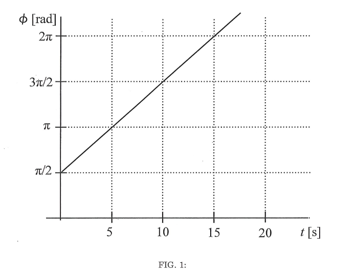

# {{ params.vars.title }}
A simple harmonic oscillator has a displacement from equilibrium $x = A \cos(\phi)$, where the phase is plotted as a function of time in Fig. 1.

## Part 1

What is the frequency of this oscillation?

### Answer Section

- {{ params.part1.ans1.value }}
- {{ params.part1.ans2.value }}
- {{ params.part1.ans3.value }}
- {{ params.part1.ans4.value }}
- {{ params.part1.ans5.value }}

## Attribution

Problem is licensed under the [CC-BY-NC-SA 4.0 license](https://creativecommons.org/licenses/by-nc-sa/4.0/).  