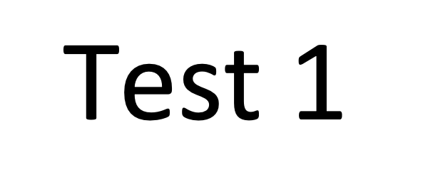
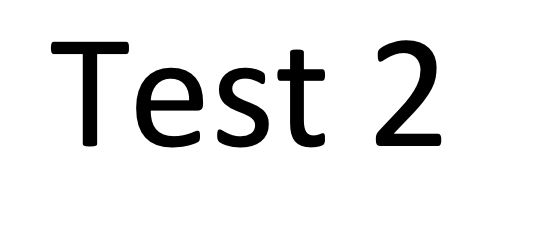

# {{ params.vars.title }}
{{ params.vars.name }} is traveling on {{ params.vars.vehicle }} at {{ params.v }} {{ params.vars.units }}.

## Part 1

How far does {{ params.vars.name }} travel in {{ params.t }} seconds, assuming they continue at the same velocity?

### Answer Section

- {{ params.part1.ans1.value }} {{ params.vars.units}}
- {{ params.part1.ans2.value }} {{ params.vars.units}}
- {{ params.part1.ans3.value }} {{ params.vars.units}}
- {{ params.part1.ans4.value }} {{ params.vars.units}}
- {{ params.part1.ans5.value }} {{ params.vars.units}}
- {{ params.part1.ans6.value }} {{ params.vars.units}}

### pl-submission-panel

Everything here will get inserted directly into the pl-submission-panel element at the end of the `question.html`.
Please remove this section if it is not application for this question.

### pl-answer-panel

Everything here will get inserted directly into an pl-answer-panel element at the end of the `question.html`.
Please remove this section if it is not application for this question.

## Attribution

Problem is from the [OpenStax University Physics Volume 2](https://openstax.org/details/books/university-physics-volume-2) textbook, licensed under the [CC-BY 4.0 license](https://creativecommons.org/licenses/by/4.0/). 