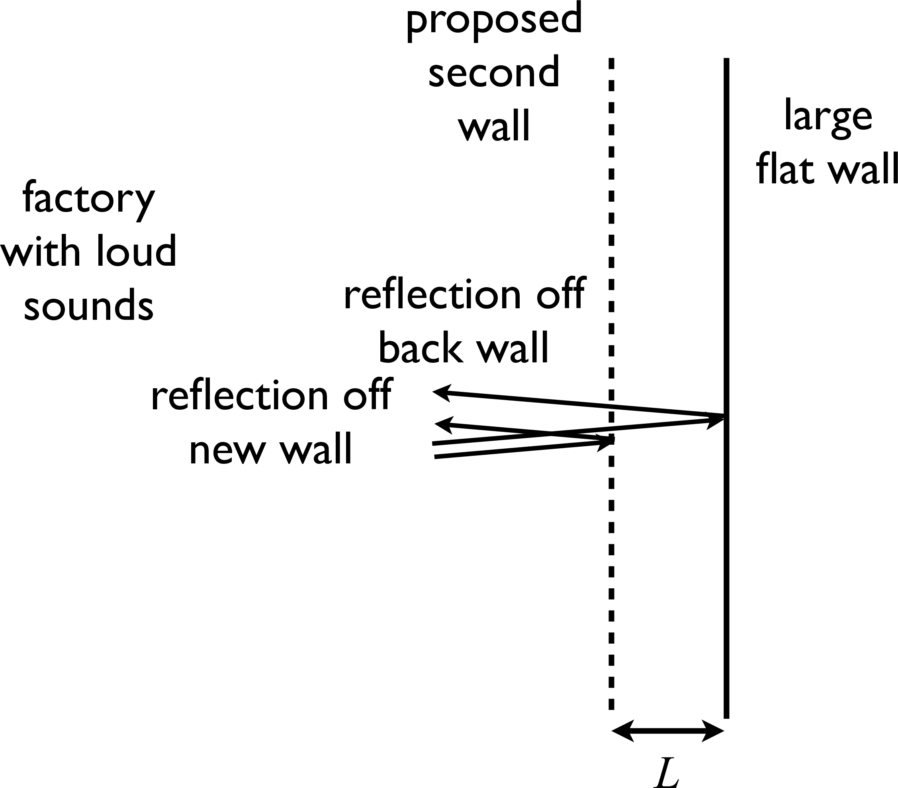

# {{ params_vars_title }}

In a factory a loud sound of frequency {{ params_f}} Hz and speed 330.0 m/s is bothering workers.  Sound engineers suggest the installation of a second wall a distance $L$ in front of a large flat wall in the room as shown by the dashed line in the figure. If built, some sound waves will reflect off the second wall, while others reflect off the large flat wall as shown by the arrows in the figure.

## Part 1

In order to achieve destructive interference of these two reflected sound waves, the distance $L$ should be?

### Answer Section

- {{ params_part1_ans1_value }} {{ params_vars_units}}
- {{ params_part1_ans2_value }} {{ params_vars_units}}
- {{ params_part1_ans3_value }} {{ params_vars_units}}
- {{ params_part1_ans4_value }} {{ params_vars_units}}
- {{ params_part1_ans5_value }} {{ params_vars_units}}

### pl-submission-panel

### pl-answer-panel

## Attribution

Problem is licensed under the [CC-BY-NC-SA 4.0 license](https://creativecommons.org/licenses/by-nc-sa/4.0/).  