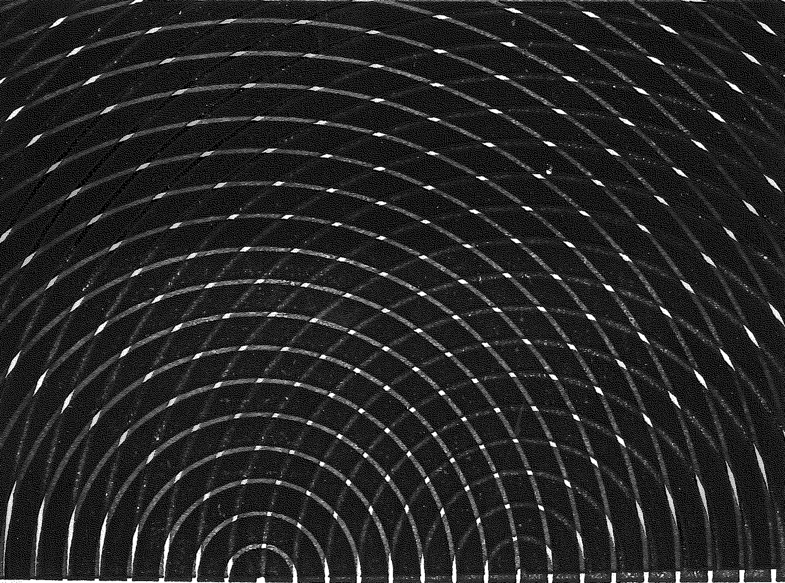

# {{ params_vars_title }}

The two-dimensional snapshot of the interference of waves from two sources is shown in the figure, where bright lines represent wave crests.

## Part 1

With an arrow identify and label the location of the two sources (call one source 1, and the other source 2) of these waves. On the same diagram at the edge of figure identify with an arrow the location of the $m = -2$, $m = 0$ and $m = 2$ antinodal lines.

Upload your labeled diagram as png named 'file'.

### Answer Section

File upload box will be shown here.

### pl-submission-panel

### pl-answer-panel

## Part 2

Along the $m = 2$ antinodal line, what is the path length difference traveled by the wave from source 2 relative to source 1 in terms of the wavelength of the wave?

### Answer Section

{{ feedback.part2_ans }}

### pl-submission-panel

### pl-answer-panel

## Part 3

Where two troughs align along an antinodal line, the intensity of the wave is

### Answer Section

- {{ params.part3.ans1}} {{ params.vars.units}}
- {{ params.part3.ans2}} {{ params.vars.units}}

### pl-submission-panel

### pl-answer-panel

## Part 4

Where a trough and a crest align along a nodal line, the intensity of the wave is

### Answer Section

- {{ params.part4.ans1}} {{ params.vars.units}}
- {{ params.part4.ans2}} {{ params.vars.units}}

### pl-submission-panel

### pl-answer-panel

## Attribution

Problem is licensed under the [CC-BY-NC-SA 4.0 license](https://creativecommons.org/licenses/by-nc-sa/4.0/).  