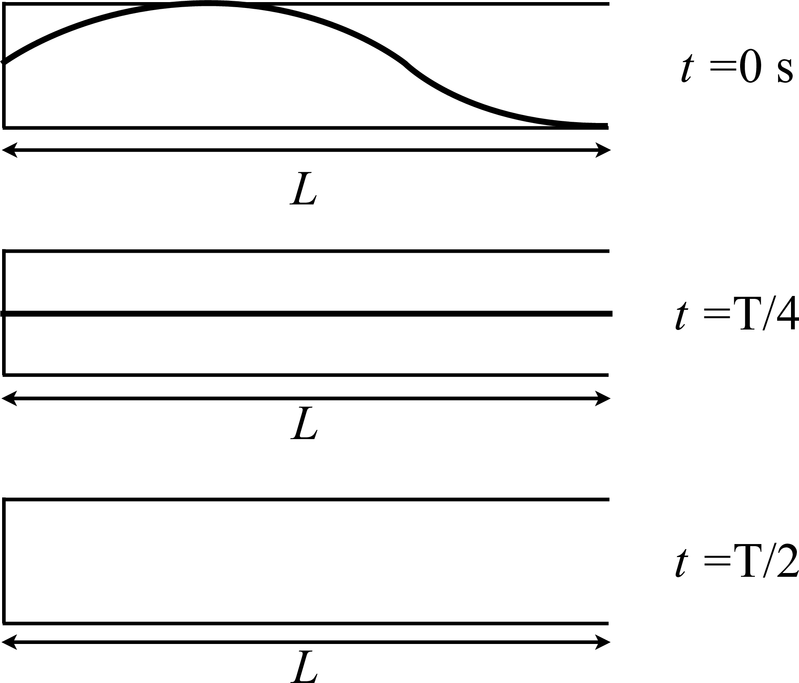

# {{ params_vars_title }}

In the figures above, snapshots of a standing wave in an open-closed tube are shown at $t$ = 0 s and $t = \frac{T}{4}$, where $T$ is the period of the wave's oscillation.

## Part 1

Based on these graphs, label any nodes and antinodes on the top figure, and then draw the snapshot graph at $t = \frac{T}{2}$ on the bottom graph.

Finally, draw arrows or dot diagrams representing the motion of the displacement of the atoms of the air in this harmonic on each graph.

Your file upload should be named 'Wave' and must be a png file.

### Answer Section

File upload box will be shown here.

### pl-submission-panel

### pl-answer-panel

## Part 2

What is the wavelength of this wave in terms of the length of the tube, $L$?

Use the following table as a reference:

| For      | Use   |
|----------|-------|
| $L$      | L     |

### Answer Section

### pl-submission-panel

### pl-answer-panel

## Part 3

Which harmonic is this standing wave?

### Answer Section

- {{ params.part3.ans1}} {{ params_vars.units}}
- {{ params.part3.ans2}} {{ params_vars.units}}
- {{ params.part3.ans3}} {{ params_vars.units}}
- {{ params.part3.ans4}} {{ params_vars.units}}

### pl-submission-panel

### pl-answer-panel

## Part 4

If this tube were in some medium with the speed of sound as {{params_v}}m/s, what length would it have to have to sound the note A ({{ params_f}}Hz) and it remained in this standing wave?

### Answer Section

### pl-submission-panel

### pl-answer-panel

## Attribution

Problem is licensed under the [CC-BY-NC-SA 4.0 license](https://creativecommons.org/licenses/by-nc-sa/4.0/).  