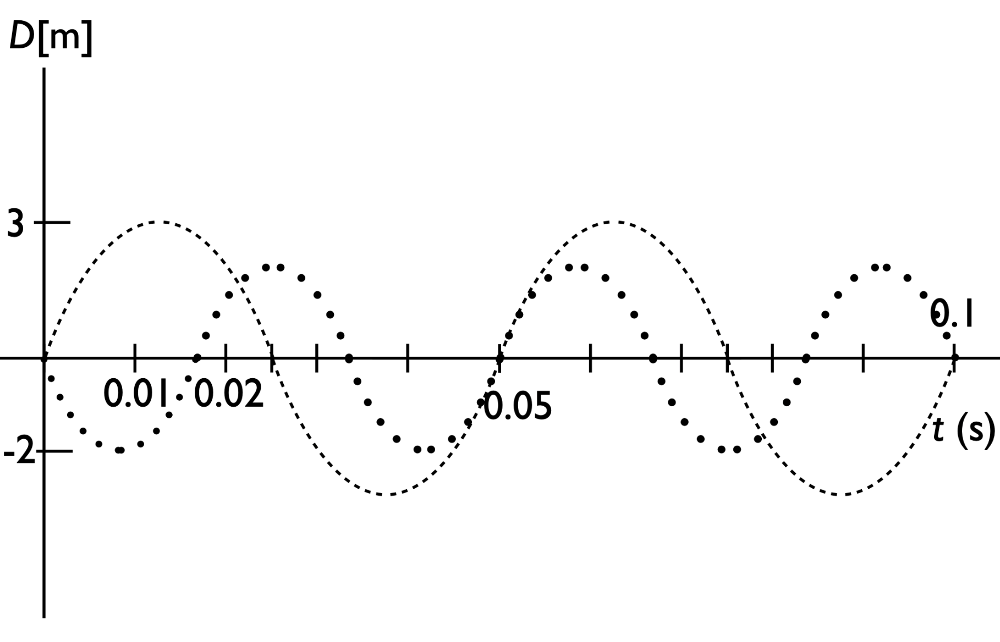

# {{ params_vars_title }}
<figure>

<figcaption>Fig.1</figcaption>
</figure>

## Useful Info

f = 1/T is the frequency expressed in Hertz (Hz), where T is the period of an oscillation. You can find the period of an oscillation by finding the time interval over which any point on a periodic curve repeats (e.g. peak to peak).

## Part 1

Identify the frequency of the dashed wave shown in Fig. 1. Give a numerical answer and the units.

### Answer Section

Please enter in a numeric value in {{ params_vars_units }}.

### pl-submission-panel

{{ feedback.part1_ans }}

### pl-answer-panel

Everything here will get inserted directly into an pl-answer-panel element at the end of the `question.html`.
Please remove this section if it is not application for this question.

## Part 2

Identify the frequency of the dotted wave shown in Fig. 1. Give a numerical answer and the units.

### Answer Section

Please enter in a numeric value in {{ params_vars_units }}.

### pl-submission-panel

{{ feedback.part2_ans }}

### pl-answer-panel

Everything here will get inserted directly into an pl-answer-panel element at the end of the `question.html`.

## Part 3a

The two original sinusoidal waves are harmonics: they are generated by the same vibrating system. However, neither is the "fundamental" frequency (the lowest frequency/longest possible wavelength) of the vibrating system. Determine the frequency of the "fundamental" standing wave of the system, and then determine which harmonics of this wave each of the dashed and dotted waves correspond to.

Fundamental frequency is (number and units) =

### Answer Section

Please enter in a numeric value in {{ params_vars_units }}.

### pl-submission-panel

{{ feedback.part3_ans }}

### pl-answer-panel

Everything here will get inserted directly into an pl-answer-panel element at the end of the `question.html`.

## Part 3b

The dashed line is the
(Enter an integer, i.e 1 for first Harmonic)

### Answer Section

Please enter a word.

### pl-submission-panel

{{ feedback.part4_ans }}

### pl-answer-panel

Everything here will get inserted directly into an pl-answer-panel element at the end of the `question.html`.

## Part 3c

The dotted line is the
(Enter an integer, i.e 1 for first Harmonic)

### Answer Section

Please enter a word.

### pl-submission-panel

{{ feedback.part5_ans }}

### pl-answer-panel

Everything here will get inserted directly into an pl-answer-panel element at the end of the `question.html`.

## Attribution

Problem is licensed under the [CC-BY-NC-SA 4.0 license](https://creativecommons.org/licenses/by-nc-sa/4.0/).  