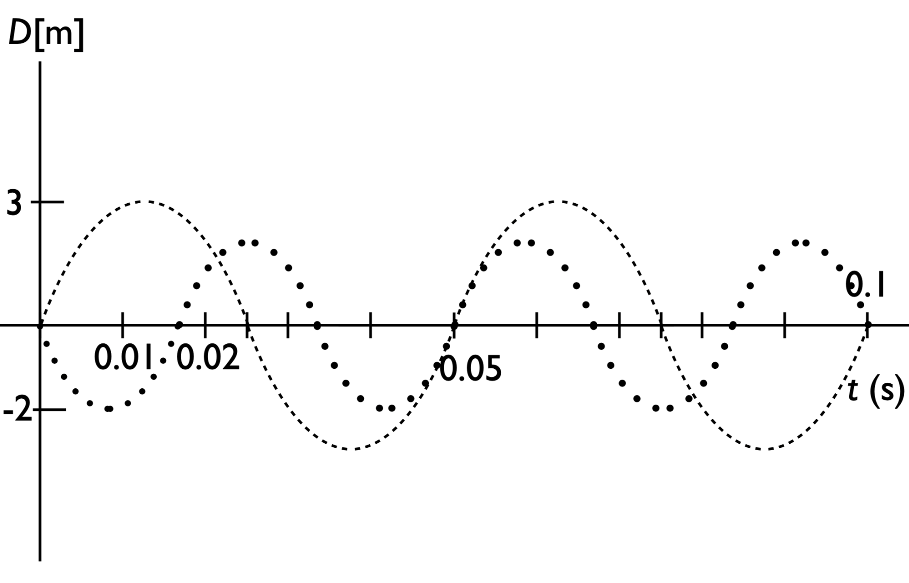

# {{ params.vars.title }}

## Question Text

Pitched sounds, such as those produced by: the human throat when singing, open and closed pipes like the flute and clarinet and string instruments, are due to regular periodic vibrations of the air molecules at integer multiples of a fundamental frequency that we associate with an intrument's "pitch".

Use the superposition principle to add the two harmonics shown in Fig. 1 together on Fig. 1. Above each dashed line (drawn on the graph 0.01 s intervals- you can skip the lines at 0.025 and 0.075 s) place a point showing the superposition of the two wavefronts and estimating the curvature of the resulting line. Draw this, then upload the resulting file.

Your file must be a png, jpg, or pdf.

<figure>

<figcaption>Fig.1</figcaption>
</figure>

## Useful Info

The fundamental frequency is also known as the first harmonic, the second harmonic is twice the fundamental frequency, the third three times the fundamental frequency, etc. In music, the timbre of a note (how rich the note sounds) reflects the relative strengths of the different harmonics that superpose to make a sound of a particular fundamental frequency, and our ears perceive combinations of harmonics of different sounds as creating sound at the pitch of the fundamental frequency, with a texture characteristic of the harmonics present. To find the net displacement of the air due to two different harmonics at any point in space at a given time one simply adds the displacements at each point: Dtotal(x,t) = D1(x,t) + D2(x,t). More generally, any periodic function can be broken into a sum of sinusoidal waves of different amplitudes through a process called spectral analysis or Fourier decomposition, where the sinusoidal waves have frequencies that are integer multiples of the fundamental frequency. This is a process used in many scientific fields.

### Answer Section

File upload box will be shown here.

### pl-submission-panel

Everything here will get inserted directly into the pl-submission-panel element at the end of the `question.html`.
Please remove this section if it is not application for this question.

### pl-answer-panel

Everything here will get inserted directly into an pl-answer-panel element at the end of the `question.html`.
Please remove this section if it is not application for this question.

## Attribution

Problem is licensed under the [CC-BY-NC-SA 4.0 license](https://creativecommons.org/licenses/by-nc-sa/4.0/).  