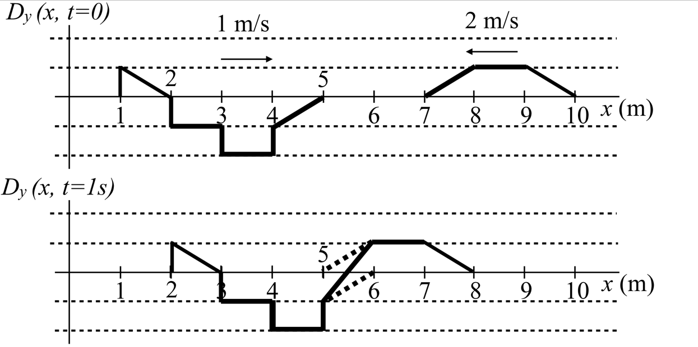
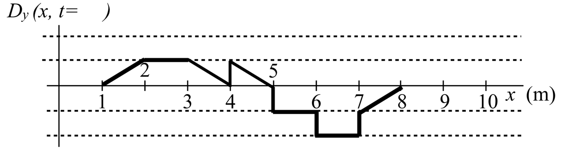
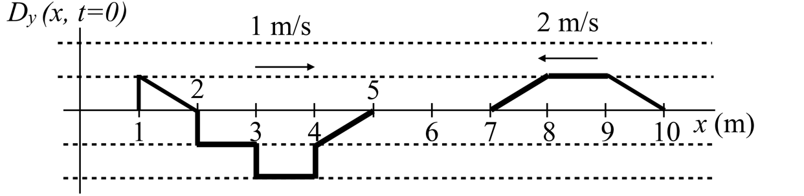
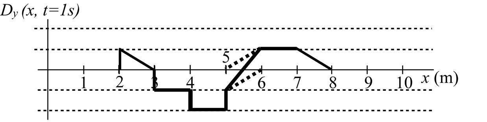

# {{ params.vars.title }}
The Figure below is a snapshot at $t = 0s$ of two wave pulses approaching each other, one travelling at $1 m/s$ (right) and the other at $2 m/s$ (left). The net displacement of the wave at $t = 1s$ is shown by the bold lines in the second graph, where dashed lines indicate the parts of the wave pulses that are overlapping and add to give the bold line.

## Part 1

What is the time of the third snapshot graph shown below?

### Answer Section

## Part 2

What is the time of the fourth snapshot graph shown below?

### Answer Section

File upload box will be shown here.

## Part 3

In the fourth graph shown in the part2, bold lines show the net displacement of that wave at a time you found.
Using this graph, draw dashed lines indicating the parts of the wave pulses that are overlapping that add to give the bold line.
Once drawn, upload your graph in the form of a pdf titled "file1".

### Answer Section

File upload box will be shown here.

## Part 4

Finally, draw points corresponding to the displacement of the string at $x = 4.5m$ for each snapshot graph on using the history graph show below.
Once drawn, upload your graph in the form of a pdf titled "file2".

### Answer Section

File upload box will be shown here.

## Attribution

Problem is licensed under the [CC-BY-NC-SA 4.0 license](https://creativecommons.org/licenses/by-nc-sa/4.0/).  