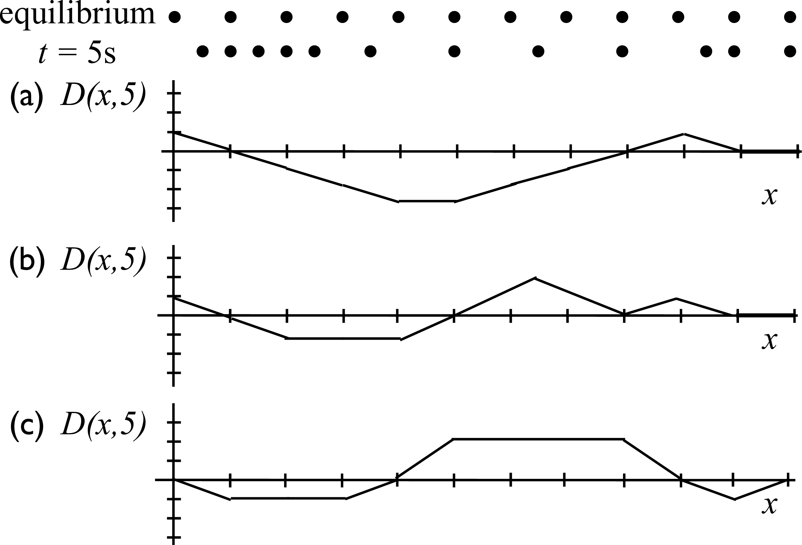
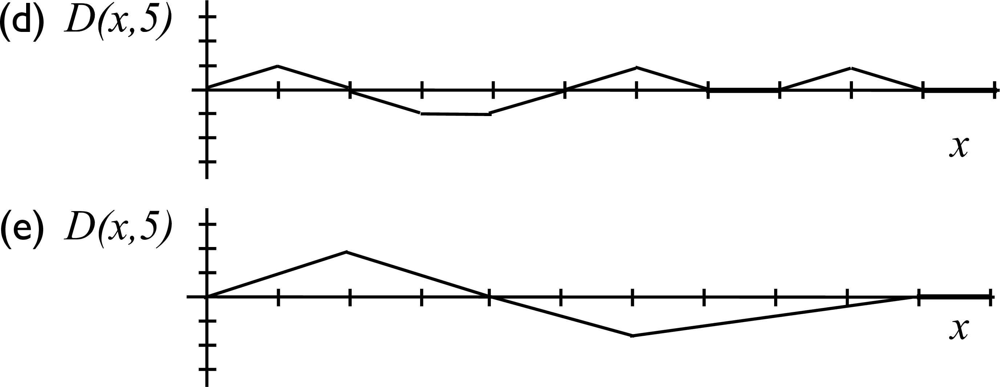

# {{ params_vars_title }}
The two dot figures below show a longitudinal wave at equilibrium, and again at $t = 5 s$ after a displacement.

## Part 1

Which snapshot graph of the displacement as a function of position at $t = 5 s$ could represent this longitudinal wave?

### Answer Section

- {{ params_part1_ans1_value }}
- {{ params_part1_ans2_value }}
- {{ params_part1_ans3_value }}
- {{ params_part1_ans4_value }}
- {{ params_part1_ans5_value }}

## Attribution

Problem is licensed under the [CC-BY-NC-SA 4.0 license](https://creativecommons.org/licenses/by-nc-sa/4.0/).  