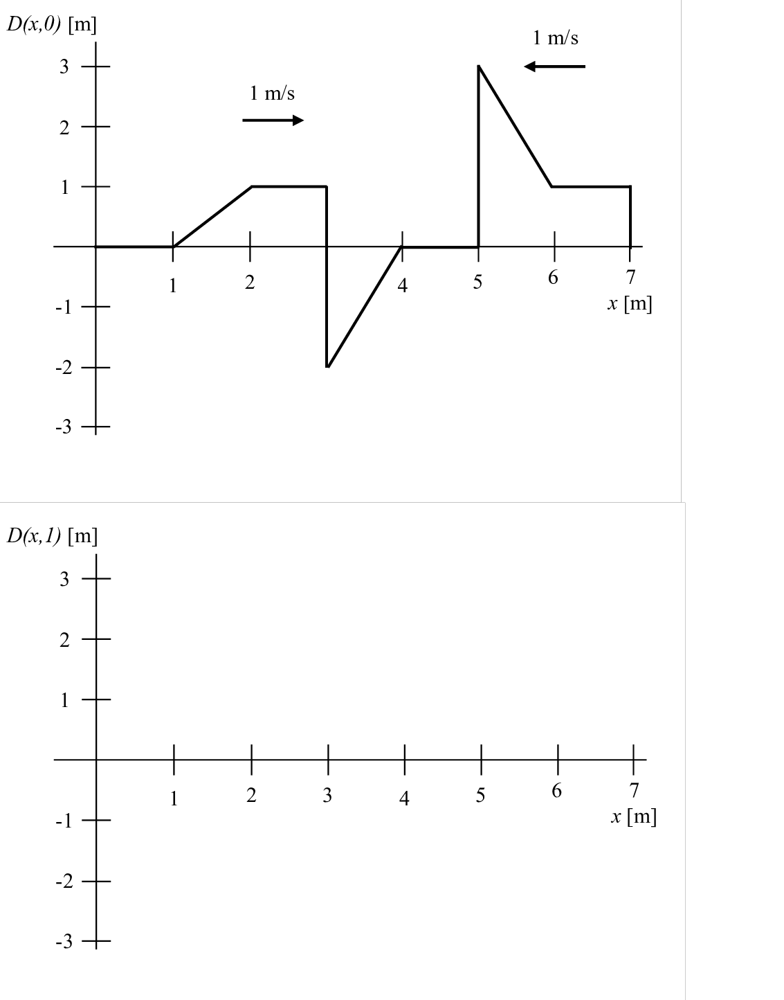
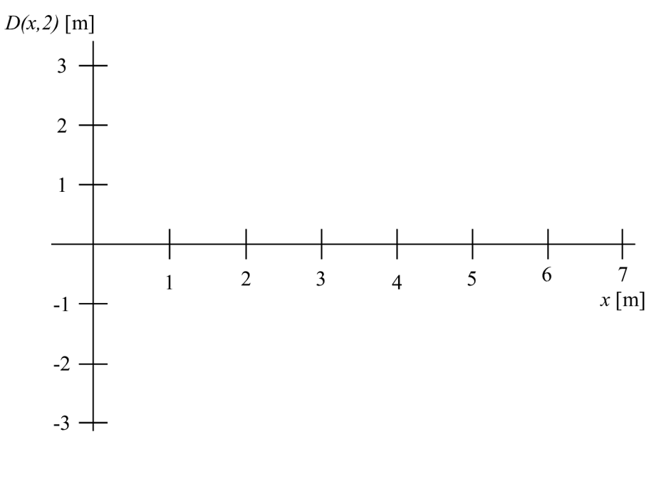
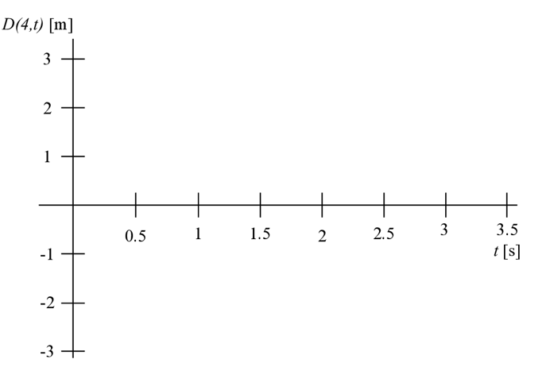

# {{ params.vars.title }}

## Part 1

At time t = 0 s, the displacement of a string is shown above. The wave pulse on the segment from x = 1 m to x = 4 m is moving to the right at 1 m/s, while the wave pulse on the segment from x = 5 m to x = 7 m is moving to the left at 1 m/s.  Draw the wave at t = 1 s.

Your file should be named 'Wave1' and must be a png.

### Answer Section

File upload box will be shown here.

## Part 2

On the figure just above draw a snapshot graph at time t  = 2 s.

Your file should be named 'Wave2' and must be a png.

### Answer Section

File upload box will be shown here.

## Part 3

On the above history graph draw points representing the displacement of the string at x = 4 m at times t = 0 s, 0.5 s, …. , 3.5 s.

On the figure just above draw a snapshot graph at time t  = 2 s.

Your file should be named 'Wave3' and must be a png.

### Answer Section

File upload box will be shown here.

## Attribution

Problem is licensed under the [CC-BY-NC-SA 4.0 license](https://creativecommons.org/licenses/by-nc-sa/4.0/).  