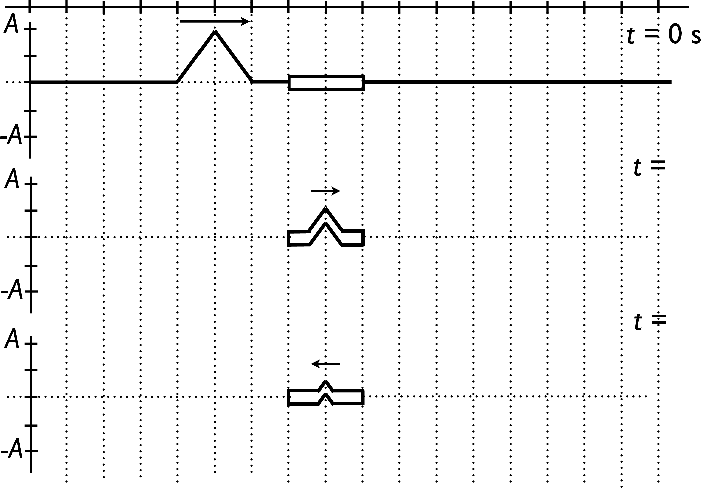

# {{ params_vars_title }}

As shown in the figure above, a wave pulse travels from a light string to a heavy string. The thicker string has a linear mass density of {{ params_t1}} kgm while the thinner string has a linear mass density of {{ params_t2}} kgm.

## Part 1

Compare the speeds of the wave as it travels in the thick and thin strings. What is the ratio of the thin string velocity to the thicker string?

### Answer Section

Please enter in a numeric value.

### pl-submission-panel

{{ feedback.part1_ans }}

### pl-answer-panel

## Part 2

The wave pulse travels at {{ params_v}} m/s within the thin string, where each vertical line represents {{ params_v}} m. The transmitted wave pulse first reaches the middle of the thick string as shown in the second diagram, and after reflecting off the end of the thick string returns to the middle of the thick string in the bottom diagram.

What is the time the second diagram occurs?

### Answer Section

Please enter in a numeric value.

### pl-submission-panel

{{ feedback.part2_ans }}

### pl-answer-panel

## Part 3

Using the information from the previous question, what is the time the third diagram occurs?

### Answer Section

Please enter in a numeric value.

### pl-submission-panel

{{ feedback.part3_ans }}

### pl-answer-panel

## Part 4

Draw and upload the shape of the thin strings (either flat or flat with a pulse of the same or opposite orientation and reduced amplitude) on either side of the thick string for the second two diagrams corresponding to the times that they occurred.

Your upload should be named 'file' and must be a png.

### Answer Section

File upload box will be shown here.

### pl-submission-panel

### pl-answer-panel

## Attribution

Problem is licensed under the [CC-BY-NC-SA 4.0 license](https://creativecommons.org/licenses/by-nc-sa/4.0/).  