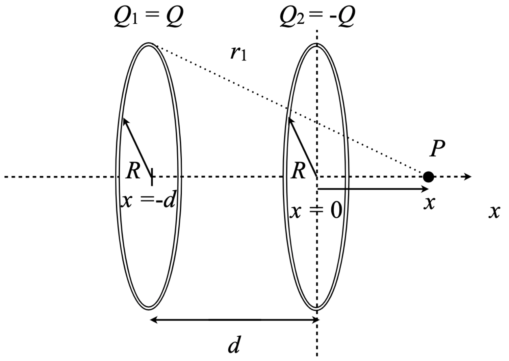

# {{ params_vars_title }}
Two thin rings of radius $R$ and charges $Q_1 = Q$ and $Q_2 = -Q$ are centred along the $x$-axis as shown in the figure below.

<!-- Button trigger modal -->

<button type="button" class="btn btn-primary" data-toggle="modal" data-target="#exampleModalLong">
  Hint
</button>

<!-- Modal -->

  

        

          

            <h5 class="modal-title" id="exampleModalLongTitle">Hint</h5>
            <button type="button" class="close" data-dismiss="modal" aria-label="Close">
              &times;
            </button>
          

          

          Along the axis of symmetry of a uniformly charged ring, we've seen that the electric potential can be expressed as $V = \frac{kQ}{r}$, where $r$ is the distance to a point on the axis of symmetry of the ring from any point on the ring, $Q$ is the total charge on the ring, and $k$ is Coulomb's constant.  When we have more than one ring, we can use regular addition to add the contributions to the total electric potential of each ring, accounting for the charge on each ring and the distance of each ring's charges from the point of interest.  To calculate electric fields along this line of symmetry we know that the electric field is the negative of rate of change of the electric potential with respect to position.  Along our axis of symmetry (the $x$-axis in this problem) this means that the electric field is given by $E_x = -\frac{dV}{dx}$.
          

          

            <button type="button" class="btn btn-secondary" data-dismiss="modal">Close</button>
          

    

  

## Part 1

Write an expression in terms of $x$, $d$ and $R$ for the distance, $r_1$, for the distance of any point on ring 1 from point $P$.
Note that this is a right-angled triangle so you can use the pythagorean theorem.

Use the following table as a reference for each variable:

| For | Use |
|-----|-----|
| $R$ | R   |
| $d$ | d   |
| $x$ | x   |
| $k$ | k   |
| $Q$ | Q   |

**If the answer is 0, enter "zero"**.

### Answer Section

### pl-submission-panel

{{feedback.part1_ans}}

## Part 2

Write an expression for the electric potential at point $P$ due to the two thin rings in terms of $Q$, $R$, $d$ and $x$.

Use the following table as a reference for each variable:

| For | Use |
|-----|-----|
| $R$ | R   |
| $d$ | d   |
| $x$ | x   |
| $k$ | k   |
| $Q$ | Q   |

**If the answer is 0, enter "zero"**.

### Answer Section

### pl-submission-panel

{{feedback.part2_ans}}

## Part 3

From your expression for the potential energy find the electric field at point $P$.
Note that it points along the $x$-axis, and remember to use the chain rule.

Use the following table as a reference for each variable:

| For | Use |
|-----|-----|
| $R$ | R   |
| $d$ | d   |
| $x$ | x   |
| $k$ | k   |
| $Q$ | Q   |

**If the answer is 0, enter "zero"**.

### Answer Section

### pl-submission-panel

{{feedback.part3_ans}}

## Part 4

When $x = -\frac{d}{2}$ evaluate the electric potential.

Use the following table as a reference for each variable:

| For | Use |
|-----|-----|
| $R$ | R   |
| $d$ | d   |
| $x$ | x   |
| $k$ | k   |
| $Q$ | Q   |

**If the answer is 0, enter "zero"**.

### Answer Section

### pl-submission-panel

{{feedback.part4_ans}}

## Part 5

When $x = -\frac{d}{2}$ evaluate the electric field.

Use the following table as a reference for each variable:

| For | Use |
|-----|-----|
| $R$ | R   |
| $d$ | d   |
| $x$ | x   |
| $k$ | k   |
| $Q$ | Q   |

**If the answer is 0, enter "zero".**

### Answer Section

### pl-submission-panel

{{feedback.part5_ans}}

## Attribution

Problem is licensed under the [CC-BY-NC-SA 4.0 license](https://creativecommons.org/licenses/by-nc-sa/4.0/).  