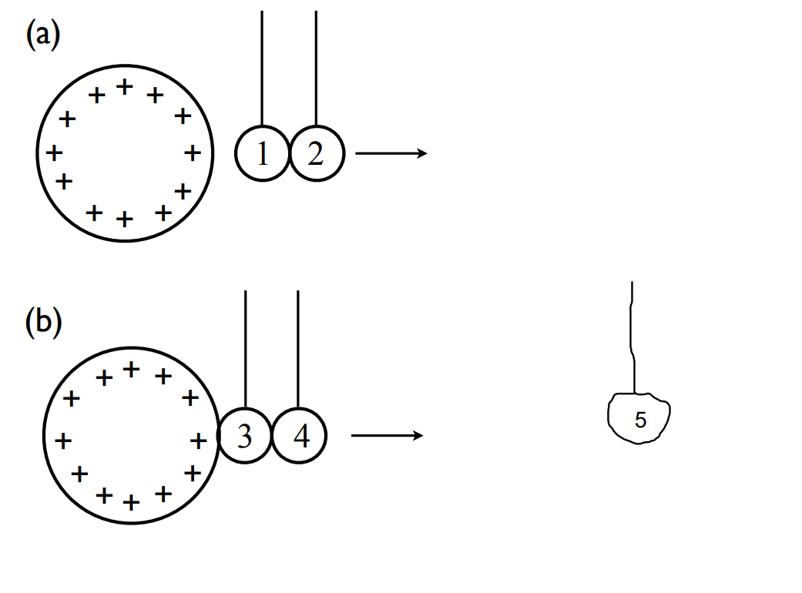

# {{ params_vars_title }}

Five identical neutral conducting balls hanging from strings are numbered 1 to 5.  As shown in the Figure above. Balls 1 and 2 touch as they are brought near a highly charged metal sphere and then are separated, with ball 1 closer to the sphere. Ball 3 contacts both the metal sphere and ball 4.  Ball 4 is pulled away from ball 3, and then ball 3 is pulled away from the metal sphere.

## Part 1

Following these charging steps, what is the sign of the charge on ball {{ params_ball}}?

### Answer Section

- {{ params_part1_ans1_value }} {{ params.vars.units}}
- {{ params_part1_ans2_value }} {{ params.vars.units}}
- {{ params_part1_ans3_value }} {{ params.vars.units}}

### pl-submission-panel

### pl-answer-panel

## Part 2

Following these charging steps, what is the sign of the charge on ball {{ params_balls }}?

### Answer Section

- {{ params_part2_ans1_value }} {{ params.vars.units}}
- {{ params_part2_ans2_value }} {{ params.vars.units}}
- {{ params_part2_ans3_value }} {{ params.vars.units}}

### pl-submission-panel

### pl-answer-panel

## Part 3

Following these charging steps, ball 1 is attracted to (choose the best answer):

### Answer Section

- {{ params_part3_ans1_value }} {{ params.vars.units}}
- {{ params_part3_ans2_value }} {{ params.vars.units}}
- {{ params_part3_ans3_value }} {{ params.vars.units}}
- {{ params_part3_ans4_value }} {{ params.vars.units}}
- {{ params_part3_ans5_value }} {{ params.vars.units}}

### pl-submission-panel

### pl-answer-panel

## Attribution

Problem is licensed under the [CC-BY-NC-SA 4.0 license](https://creativecommons.org/licenses/by-nc-sa/4.0/).  