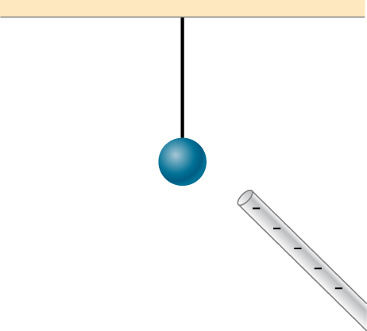

# {{ params.vars.title }}

## Part 1

An uncharged conducting sphere is suspended from the ceiling as shown in the figure.
A negatively charged rod is brought nearby.

The neutral conductor is:

### Answer Section

- {{ params.part1.ans1.value }}
- {{ params.part1.ans2.value }}
- {{ params.part1.ans3.value }}

## Attribution

Problem is from the [OpenStax University Physics Volume 2](https://openstax.org/details/books/university-physics-volume-2) textbook, licensed under the [CC-BY 4.0 license](https://creativecommons.org/licenses/by/4.0/). 