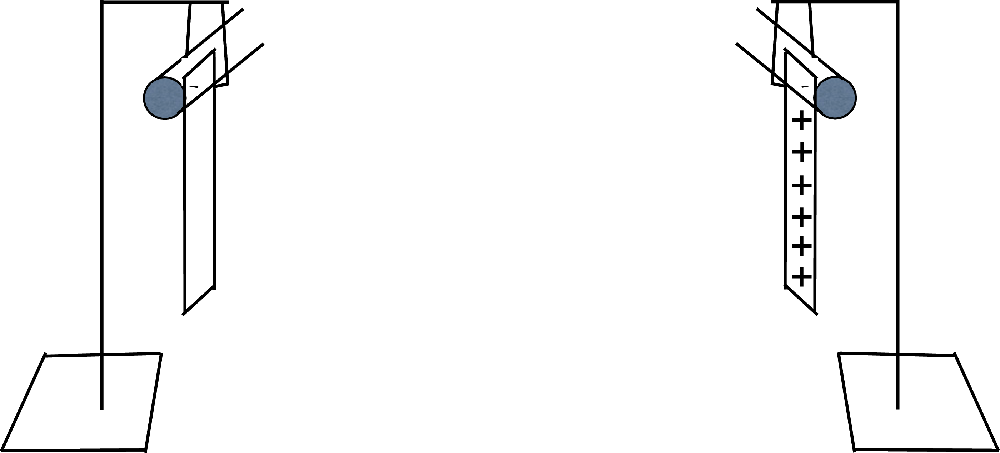
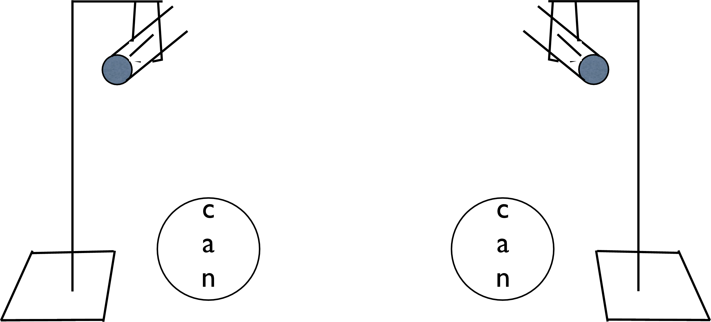
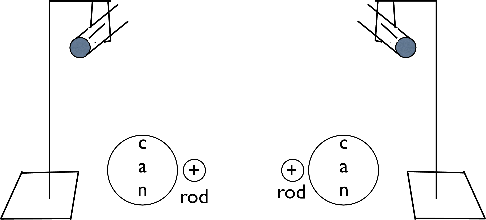

# {{ params_vars_title }}
Two neutral pieces of scotch tape are stuck together and quickly ripped apart, resulting in each becoming charged. They are then suspended from lab stands as shown below. The lab stands are a long way from one another.

## Part1

In the figure above, the charge distribution on one piece of tape is show. Draw the charge distribution on the other piece of tape.
Submit and upload your file as a pdf, jpg, or png titled "file1".

### Answer Section

File upload box will be shown here.

## Part2

 
 
A neutral aluminum soda can is brought close to each piece of tape as shown in the figure directly above. Draw the tapes' positions, the locations of the charges in each of the cans, and the location of charges in each piece of tape using the diagram.
Submit and upload your file as a pdf, jpg, or png titled "file2".

### Answer Section

File upload box will be shown here.

## Part3

 
 
A strongly positively charged rod is now brought close to each can as show in the figure directly above. Draw the tapes' positions and the distributions of the charges both along each piece of tape and in each of the cans.
Submit and upload your file as a pdf, jpg, or png titled "file3".

### Answer Section

File upload box will be shown here.

## Attribution

Problem is licensed under the [CC-BY-NC-SA 4.0 license](https://creativecommons.org/licenses/by-nc-sa/4.0/).  