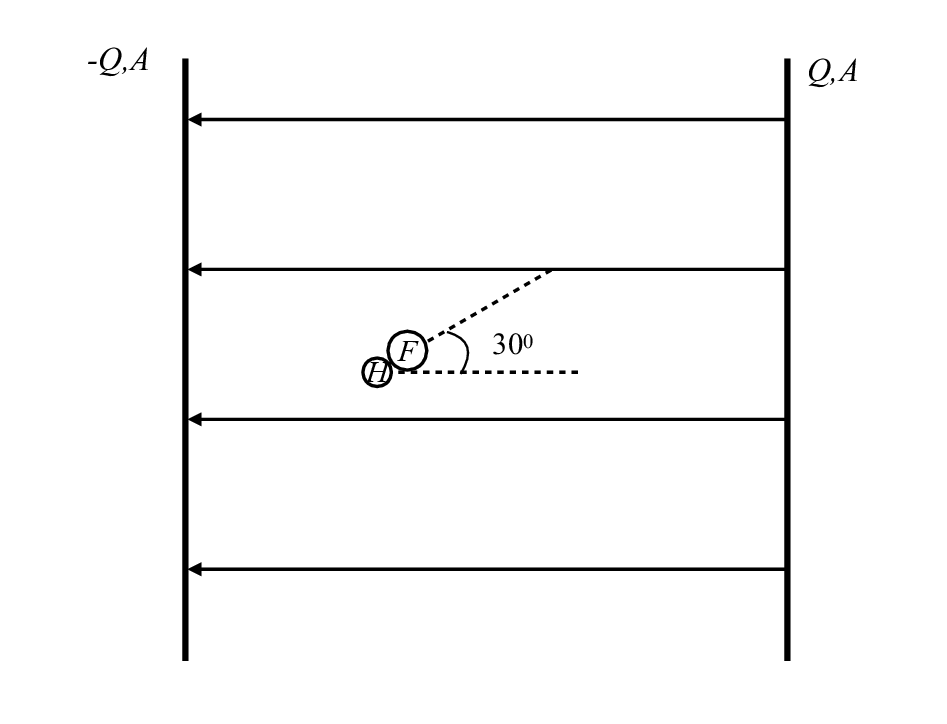

# {{ params_vars_title }}

Hydrogen fluoride is a polar molecule with a bond length of about 0.92 x 10-10 m and can be roughly modeled as having a point charge of 6.6 x 10-20 C on the hydrogen atom and another of -6.6 x 10-20 C on the fluorine atom.  If this molecule is on the angle shown in a parallel plate capacitor with charge per unit area Q/A on its positive plate;

## Part 1

What electric field does this molecule feel (assume that it is far from the ends of the plates, or that they are infinite in extent). Express your answer in terms of Q, ε_0 and A.

| For  | Use   |
|------|-------|
| $Q$  | Q  |
| $A$  | A  |
| $ε_0$| e_0  |

### Answer Section

### pl-submission-panel

### pl-answer-panel

## Part 2

Calculate the electric force on each atom, and find the net force acting on the molecule.

### Answer Section

Please enter in a numeric value in {{ params.vars.units }}.

### pl-submission-panel

{{ feedback.part2_ans }}

### pl-answer-panel

## Part 3

Calculate the net torque on the HF molecule. Use the convention that clockwise is negative, and counterclockwise is positive. (Note; Enter whole number for the numeric part of your answer i,e 125^-23 instead of 1.25^-21)

| For  | Use   |
|------|-------|
| $Q$  | Q  |
| $A$  | A  |
| $ε_0$| e_0  |

### Answer Section

### pl-submission-panel

### pl-answer-panel

## Attribution

Problem is licensed under the [CC-BY-NC-SA 4.0 license](https://creativecommons.org/licenses/by-nc-sa/4.0/).  