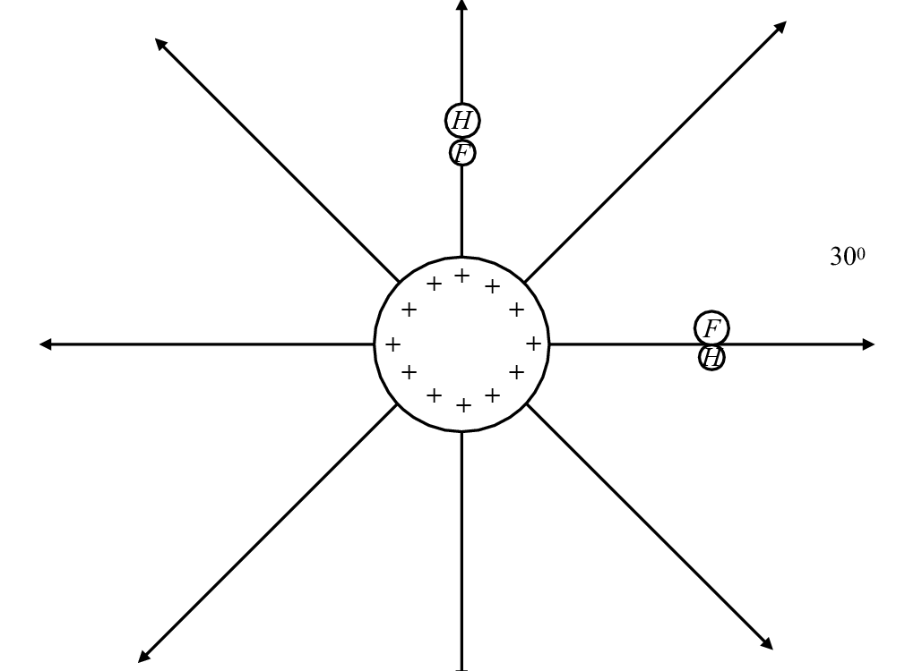

# {{ params.vars.title }}
Hydrogen fluoride is a polar molecule with a bond length of about 0.92 x 10-10 m and can be roughly modeled as having a point charge of 6.6 x 10-20 C on the hydrogen atom and another of -6.6 x 10-20 C on the fluorine atom.

## Part 1

What will the HF molecule tend to do if placed in this geometry?

### Answer Section

Answer in 3-4 sentences, try and use full sentences.

## Part 2

A metal sphere is positively charged and has electric field lines as drawn.

If the hydrogen fluoride molecule is placed with its axis along one of the field lines (above the sphere), which of the following statements are true?

### Answer Section

Note: You will be awarded full marks only if you select all the correct choices, and none of the incorrect choices. Choosing incorrect choices as well as not choosing correct choices will result in deductions.

- {{ params.part2.ans1.value}}
- {{ params.part2.ans2.value}}
- {{ params.part2.ans3.value}}
- {{ params.part2.ans4.value}}
- {{ params.part2.ans5.value}}
- {{ params.part2.ans6.value}}

## Part 3

If the hydrogen fluoride molecule is placed with its axis perpendicular to the electric field lines, which of the following statements are correct?

### Answer Section

Note: You will be awarded full marks only if you select all the correct choices, and none of the incorrect choices. Choosing incorrect choices as well as not choosing correct choices will result in deductions.

- {{ params.part3.ans1.value}}
- {{ params.part3.ans2.value}}
- {{ params.part3.ans3.value}}
- {{ params.part3.ans4.value}}
- {{ params.part3.ans5.value}}
- {{ params.part3.ans6.value}}

## Attribution

Problem is licensed under the [CC-BY-NC-SA 4.0 license](https://creativecommons.org/licenses/by-nc-sa/4.0/).  