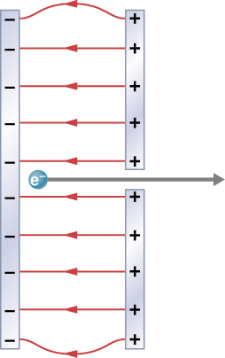

# {{ params.vars.title }}
A simple and common technique for accelerating electrons is shown in the figure, where there is a uniform electric field between two plates.
Electrons are released from rest, usually from a hot filament, near the negative plate, and there is a small hole in the positive plate that allows the electrons to pass through it.

## Question Text

Calculate the acceleration of the electron if the field strength  is ${{ params.E }}\times 10^{{ params.p }}\textrm{ N/C}$.

### Answer Section

## Attribution

Problem is from the [OpenStax University Physics Volume 2](https://openstax.org/details/books/university-physics-volume-2) textbook, licensed under the [CC-BY 4.0 license](https://creativecommons.org/licenses/by/4.0/). 