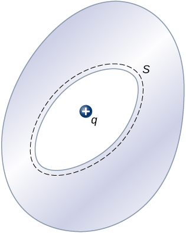

# {{ params.vars.title }}
The conductor in the figure has an excess charge of ${{params.Q}}\rm\ \mu C$.
A point charge $q = {{params.q}}\rm\ \mu C$ is placed in the cavity.

## Part 1

What is the net charge on the surface of the cavity?
Give your answer in units of micro-Coulombs.

### Answer Section

## Part 2

What is the net charge on the outer surface of the conductor?
Give your answer in units of micro-Coulombs.

### Answer Section

### pl-submission-panel

{{ feedback.part1_ans }} 
{{ feedback.part2_ans }}

### pl-answer-panel

$Q\_\mathrm{cavity}=$ {{ correct_answers.part1_ans_str }} $\rm\ \mu C$ 
$Q\_\mathrm{outer}=$ {{ correct_answers.part2_ans_str }} $\rm\ \mu C$

## Attribution

Problem is from the [OpenStax University Physics Volume 2](https://openstax.org/details/books/university-physics-volume-2) textbook, licensed under the [CC-BY 4.0 license](https://creativecommons.org/licenses/by/4.0/). 