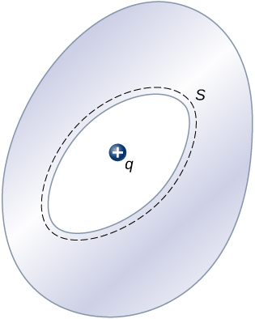

# {{ params_vars_title }}

## Part 1

Will a charge placed outside the conductor experience an electric field due to the presence of $q$ inside the cavity of the conductor?

 

### Answer Section

- {{ params_part1_ans1_value }}
- {{ params_part1_ans2_value }}

## Attribution

Problem is from the [OpenStax University Physics Volume 2](https://openstax.org/details/books/university-physics-volume-2) textbook, licensed under the [CC-BY 4.0 license](https://creativecommons.org/licenses/by/4.0/). 