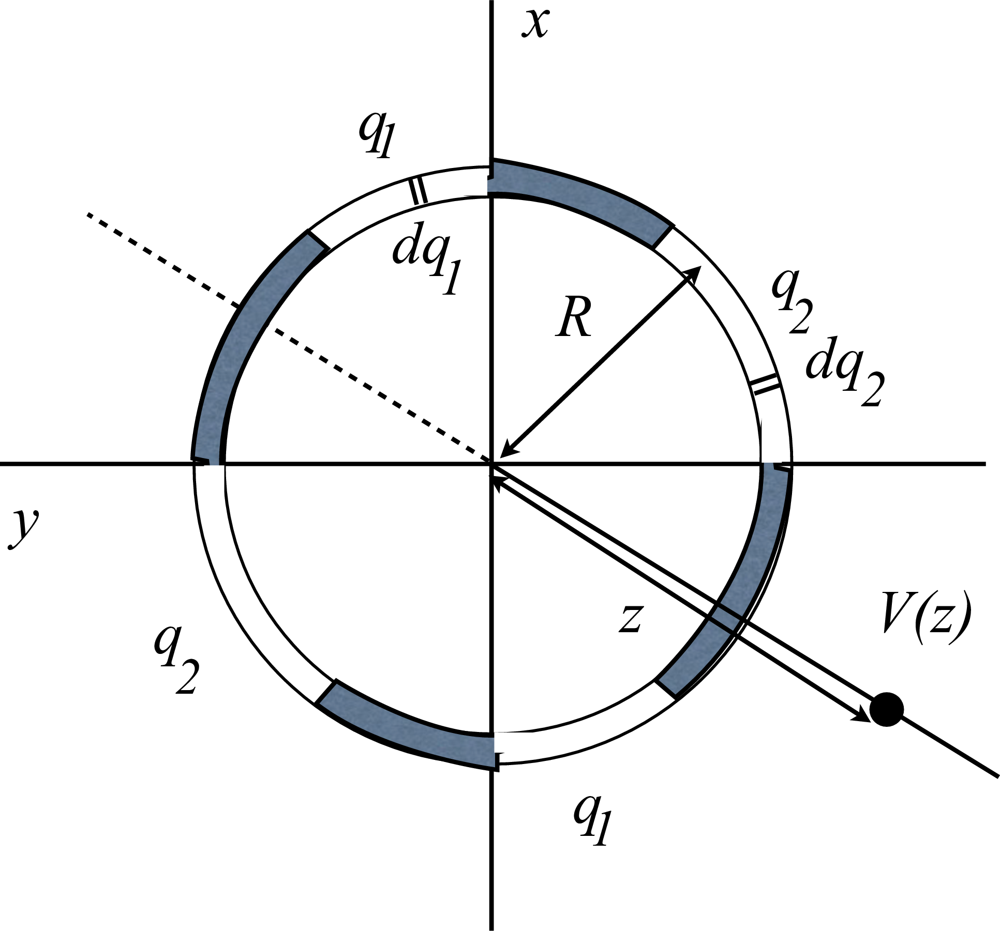

# {{ params.vars.title }}
A thin ring of radius $R$ lies in the $xy$ plane, centred on the $z$-axis. The ring has four uncharged insulating pieces. (dark patches of figure below) and four metallic ars. Two of these metallic arcs have charge $q_1$ and two have charge $q_2$, symmetrically placed about ($x$, $y$, $z$) = (0,0,0) as shown in the figure below.

## Part 1

Write the small element of the electric potential $dV_1$ at heigh $z$ along the $z$-axis due to a small element of charge $dq_1$ as shown in the figure above.
Hint: assume the small element of charge is small enough to treat as a point charge.

Use the following table as a reference for each variable:

| For    | Use |
|--------|-----|
| $R$    | R   |
| $K$    | K   |
| $dq_1$ | dq1 |
| $dq_2$ | dq2 |
| $q_1$  | q1  |
| $q_2$  | q2  |
| $z$    | z   |

**If the answer is 0, enter "zero"**.

### Answer Section

## Part 2

Write the small element of the electric potential $dV_2$ at heigh $z$ along the $z$-axis due to a small element of charge $dq_2$ as shown in the figure above.

Use the following table as a reference for each variable:

| For    | Use |
|--------|-----|
| $R$    | R   |
| $K$    | K   |
| $dq_1$ | dq1 |
| $dq_2$ | dq2 |
| $q_1$  | q1  |
| $q_2$  | q2  |
| $z$    | z   |

**If the answer is 0, enter "zero"**.

### Answer Section

## Part 3

For $any$ small element of charge $dq_1$ on either patch of charge $q_1$, would you get the result found in (a)?

### Answer Section

- {{ params.part3.ans1.value }}
- {{ params.part3.ans2.value }}
- {{ params.part3.ans3.value }}
- {{ params.part3.ans4.value }}

## Part 4

Integrate your expressions from parts (a) and (b) to find the total electric potential due to this ring along the $z$-axis at $z$ = 3m.

Use the following table as a reference for each variable:

| For    | Use |
|--------|-----|
| $R$    | R   |
| $K$    | K   |
| $dq_1$ | dq1 |
| $dq_2$ | dq2 |
| $q_1$  | q1  |
| $q_2$  | q2  |
| $z$    | z   |

**If the answer is 0, enter "zero"**.

### Answer Section

## Part 5

Assuming that the charged patches are of equal sizes and on opposite sides of the ring, as shown in Fig. 1, explain what direction the electric field of this ring would have to point in and why.

### Answer Section

- {{ params.part5.ans1.value }}
- {{ params.part5.ans2.value }}
- {{ params.part5.ans3.value }}
- {{ params.part5.ans4.value }}

## Part 6

Find the $z$-component of the electric field due to this ring at height $z$.

Use the following table as a reference for each variable:

| For    | Use |
|--------|-----|
| $R$    | R   |
| $K$    | K   |
| $dq_1$ | dq1 |
| $dq_2$ | dq2 |
| $q_1$  | q1  |
| $q_2$  | q2  |
| $z$    | z   |

**If the answer is 0, enter "zero".**

### Answer Section

## Part 7

If $q_1$ = {{ params.b}}$\mu C$ and $q_2$ = {{ params.c}}$\mu C$, $R$ = {{ params.d}}m and $z$ = {{ params.e}}m, find $V$.

Note: $\mu = 10^{-6}$ and $K$ = 9.0 $\times 10^9 \frac{\text{N m}^2}{\text{C}^2}$

### Answer Section

## Part 8

If $q_1$ = {{ params.b}}$\mu C$ and $q_2$ = {{ params.c}}$\mu C$, $R$ = {{ params.d}}m and $z$ = {{ params.e}}m, find $E_z$.

Note: $\mu = 10^{-6}$ and $K$ = 9.0 $\times 10^9 \frac{\text{N m}^2}{\text{C}^2}$

### Answer Section

## Attribution

Problem is licensed under the [CC-BY-NC-SA 4.0 license](https://creativecommons.org/licenses/by-nc-sa/4.0/).  