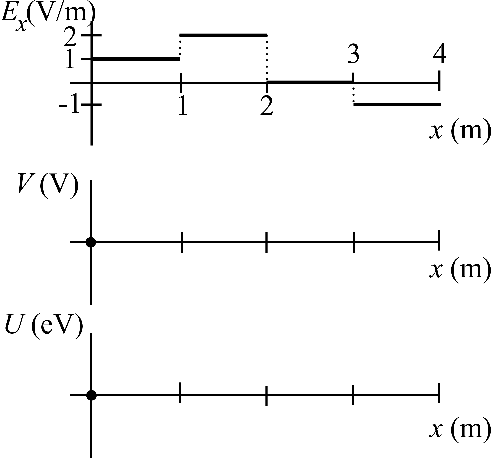

# {{ params_vars_title }}
An electron moves in an electric field as a function of position as shown in figure below. Regions of constant electric field are joined by jump discontinuities as shown by the vertical dotted lines.

## Useful Info

Express your answers in eV (electron-Volts) rather than converting to joules. (Note that the charge on an electron is -e, so an electron in an electric potential of $1$V feels a potential energy of -1 eV.  Also note that the potential energy at $x = 0$ is given.)

## Part 1

a. On the second graph, the electric potential at $x$=0 is shown.  Draw the electric potential for $x$ from 0 to 3 m.

b. On the lowest graph, draw the electric potential energy as a function of position for an electron experiencing the electric field shown in the figure.

Your file must be a png named 'Electron'.

### Answer Section

File upload box will be shown here.

### pl-submission-panel

### pl-answer-panel

## Attribution

Problem is licensed under the [CC-BY-NC-SA 4.0 license](https://creativecommons.org/licenses/by-nc-sa/4.0/).  