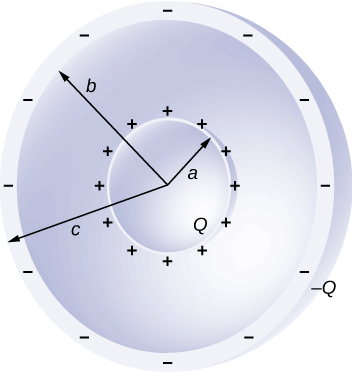

# {{ params.vars.title }}
Concentric conducting spherical shells carry charges of $Q$ and $-Q$ as shown in the figure.
The inner shell of radius $a$ has negligible thickness.
The outer shell has an inner radius $b$.

## Question Text

Find an expression for the potential difference between the shells.
In your expression, use Coulomb's constant $k$ to represent $1/(4\pi\varepsilon_0)$.

### Answer Section

## Attribution

Problem is from the [OpenStax University Physics Volume 2](https://openstax.org/details/books/university-physics-volume-2) textbook, licensed under the [CC-BY 4.0 license](https://creativecommons.org/licenses/by/4.0/). 