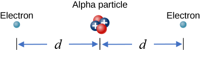

# {{ params_vars_title }}
To form a helium atom, an alpha particle that contains two protons and two neutrons is fixed at one location, and two electrons are brought from far away, one at a time.
The first electron is placed a distance $d = {{ params_d }}\times 10^{ {{ params_p }} }\rm\ m$ from the alpha particle and held there while the second electron is brought a distance $d = {{ params_d }}\times 10^{ {{ params_p }} }\rm\ m$ from the alpha particle on the other side from the first electron.
The final configuration of the particles is shown in the figure.

## Question Text

What is the work done by the system to assemble the charges?

### Answer Section

Please enter a numeric value.

### pl-submission-panel

{{ feedback.part1_ans }}

## Attribution

Problem is from the [OpenStax University Physics Volume 2](https://openstax.org/details/books/university-physics-volume-2) textbook, licensed under the [CC-BY 4.0 license](https://creativecommons.org/licenses/by/4.0/). 