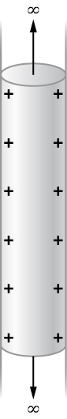

# {{ params.vars.title }}
The surface charge density on a long straight hollow metallic pipe is σ.  Assume the pipe has a diameter of $2a$.

## Part 1

What is the electric potential inside the pipe?
Choose the zero of electric potential to be a distance $R_0>a$ from the axis of the pipe.

You may copy the Greek symbols ϵ0 and σ into your symbolic expression.

### Answer Section

## Attribution

Problem is from the [OpenStax University Physics Volume 2](https://openstax.org/details/books/university-physics-volume-2) textbook, licensed under the [CC-BY 4.0 license](https://creativecommons.org/licenses/by/4.0/). 