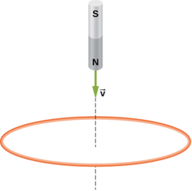

# {{ params.vars.title }}

## Part 1

The north pole of a magnet is moved toward a copper loop, as shown below. If you are looking at the loop from above the magnet, will you say the induced current is circulating clockwise or counterclockwise?

### Answer Section

- {{ params.part1.ans1.value }}
- {{ params.part1.ans2.value }}

## Attribution

Problem is from the [OpenStax University Physics Volume 2](https://openstax.org/details/books/university-physics-volume-2) textbook, licensed under the [CC-BY 4.0 license](https://creativecommons.org/licenses/by/4.0/). 