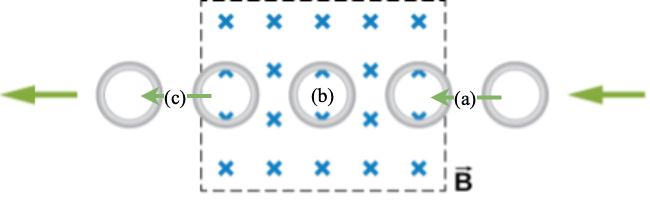

# {{ params.vars.title }}
The figure below shows a conducting ring at various positions as it moves through a magnetic field.

## Part 1

As the conducting ring enters the magnetic field, $\textrm{(a)}$, what direction is the induced current, if any, flowing through the ring?

### Answer Section

- {{ params.part1.ans1.value }}
- {{ params.part1.ans2.value }}
- {{ params.part1.ans3.value }}

## Part 2

When the conducting ring is fully inside the magnetic field, $\textrm{(b)}$, what direction is the induced current, if any, flowing through the ring?

### Answer Section

- {{ params.part2.ans1.value }}
- {{ params.part2.ans2.value }}
- {{ params.part2.ans3.value }}

## Part 3

As the conducting ring exits the magnetic field, $\textrm{(c)}$, what direction is the induced current, if any, flowing through the ring?

### Answer Section

- {{ params.part3.ans1.value }}
- {{ params.part3.ans2.value }}
- {{ params.part3.ans3.value }}

## Attribution

Problem is from the [OpenStax University Physics Volume 2](https://openstax.org/details/books/university-physics-volume-2) textbook, licensed under the [CC-BY 4.0 license](https://creativecommons.org/licenses/by/4.0/). 