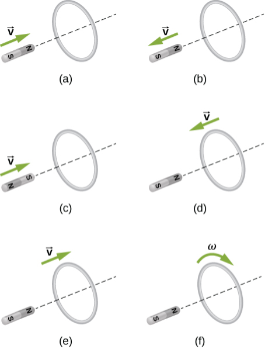

# {{ params.vars.title }}
The figure below shows a bar magnet and a conducting ring interacting in various scenarios. For each scenario, state the direction of the induced current in the ring, observing from the side of the magnet.

## Part 1

What direction is the induced current (as viewed from the magnet) in the ring in scenario $\textrm{(a)}$?

### Answer Section

- {{ params.part1.ans1.value }}
- {{ params.part1.ans2.value }}
- {{ params.part1.ans3.value }}

## Part 2

What direction is the induced current (as viewed from the magnet) in the ring in scenario $\textrm{(b)}$?

### Answer Section

- {{ params.part2.ans1.value }}
- {{ params.part2.ans2.value }}
- {{ params.part2.ans3.value }}

## Part 3

What direction is the induced current (as viewed from the magnet) in the ring in scenario $\textrm{(c)}$?

### Answer Section

- {{ params.part3.ans1.value }}
- {{ params.part3.ans2.value }}
- {{ params.part3.ans3.value }}

## Part 4

What direction is the induced current (as viewed from the magnet) in the ring in scenario $\textrm{(d)}$?

### Answer Section

- {{ params.part4.ans1.value }}
- {{ params.part4.ans2.value }}
- {{ params.part4.ans3.value }}

## Part 5

What direction is the induced current (as viewed from the magnet) in the ring in scenario $\textrm{(e)}$?

### Answer Section

- {{ params.part5.ans1.value }}
- {{ params.part5.ans2.value }}
- {{ params.part5.ans3.value }}

## Part 6

What direction is the induced current (as viewed from the magnet) in the ring in scenario $\textrm{(f)}$?

### Answer Section

- {{ params.part6.ans1.value }}
- {{ params.part6.ans2.value }}
- {{ params.part6.ans3.value }}

## Attribution

Problem is from the [OpenStax University Physics Volume 2](https://openstax.org/details/books/university-physics-volume-2) textbook, licensed under the [CC-BY 4.0 license](https://creativecommons.org/licenses/by/4.0/). 