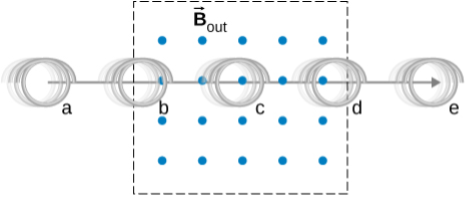

# {{ params_vars_title }}
A coil is moved through a magnetic field as shown below. The field is uniform inside the rectangle and zero outside.

## Part 1

What is the direction of the induced current in the coil at position (a)?

### Answer Section

- {{ params_part1_ans1_value }}
- {{ params_part1_ans2_value }}
- {{ params_part1_ans3_value }}

## Part 2

What is the direction of the magnetic force on the coil at position (a)?

### Answer Section

- {{ params_part2_ans1_value }}
- {{ params_part2_ans2_value }}
- {{ params_part2_ans3_value }}

## Part 3

What is the direction of the induced current in the coil at position (b)?

### Answer Section

- {{ params_part3_ans1_value }}
- {{ params_part3_ans2_value }}
- {{ params_part3_ans3_value }}

## Part 4

What is the direction of the magnetic force on the coil at position (b)?

### Answer Section

- {{ params_part4_ans1_value }}
- {{ params_part4_ans2_value }}
- {{ params_part4_ans3_value }}

## Part 5

What is the direction of the induced current in the coil at position (c)?

### Answer Section

- {{ params_part5_ans1_value }}
- {{ params_part5_ans2_value }}
- {{ params_part5_ans3_value }}

## Part 6

What is the direction of the magnetic force on the coil at position (c)?

### Answer Section

- {{ params_part6_ans1_value }}
- {{ params_part6_ans2_value }}
- {{ params_part6_ans3_value }}

## Part 7

What is the direction of the induced current in the coil at position (d)?

### Answer Section

- {{ params_part7_ans1_value }}
- {{ params_part7_ans2_value }}
- {{ params_part7_ans3_value }}

## Part 8

What is the direction of the magnetic force on the coil at position (d)?

### Answer Section

- {{ params_part8_ans1_value }}
- {{ params_part8_ans2_value }}
- {{ params_part8_ans3_value }}

## Part 9

What is the direction of the induced current in the coil at position (e)?

### Answer Section

- {{ params_part9_ans1_value }}
- {{ params_part9_ans2_value }}
- {{ params_part9_ans3_value }}

## Part 10

What is the direction of the magnetic force on the coil at position (e)?

### Answer Section

- {{ params_part10_ans1_value }}
- {{ params_part10_ans2_value }}
- {{ params_part10_ans3_value }}

## Attribution

Problem is from the [OpenStax University Physics Volume 2](https://openstax.org/details/books/university-physics-volume-2) textbook, licensed under the [CC-BY 4.0 license](https://creativecommons.org/licenses/by/4.0/). 