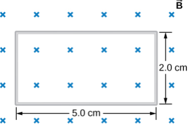

# {{ params.vars.title }}

## Question Text

The figure below shows a single-turn rectangular coil that has a resistance of ${{params.R }}\rm \ \Omega$. The magnetic field at all points inside the coil varies according to $B=B_0e^{-{\alpha}t}$, where $B_0$ = ${{params.B }}\textrm{ T}$ and $\alpha$ = ${{params.f }}\textrm{ Hz}$. What is the current induced in the coil at ${{params.t }}\textrm{ s}$?

### Answer Section

## Attribution

Problem is from the [OpenStax University Physics Volume 2](https://openstax.org/details/books/university-physics-volume-2) textbook, licensed under the [CC-BY 4.0 license](https://creativecommons.org/licenses/by/4.0/). 