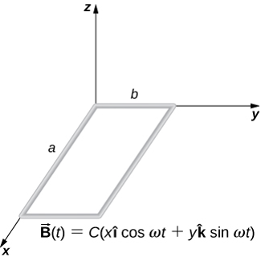

# {{ params.vars.title }}

## Part 1

A rectangular wire loop with length $a$ and width $b$ lies in the xy-plane, as shown below. Within the loop there is a time-dependent magnetic field given in the figure below in units of tesla. Determine the emf induced in the loop as a function of time.

### Answer Section

- {{ params.part1.ans1.value }}
- {{ params.part1.ans2.value }}
- {{ params.part1.ans3.value }}
- {{ params.part1.ans4.value }}
- {{ params.part1.ans5.value }}

## Attribution

Problem is from the [OpenStax University Physics Volume 2](https://openstax.org/details/books/university-physics-volume-2) textbook, licensed under the [CC-BY 4.0 license](https://creativecommons.org/licenses/by/4.0/). 