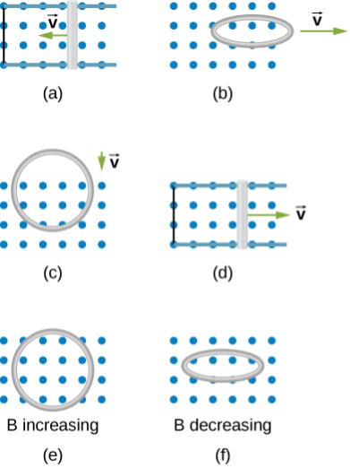

# {{ params_vars_title }}
Use Lenz's law to determine the direction of induced current in each case.

## Part 1

Scenario (a) depicts a conducting rod moving with velocity $\overrightarrow{ v }$ along parallel connected wires, creating a closed loop. What direction is the induced current in the loop?

### Answer Section

- {{ params_part1_ans1_value }}
- {{ params_part1_ans2_value }}
- {{ params_part1_ans3_value }}

## Part 2

Scenario (b) depicts a circular ring of wire moving with velocity $\overrightarrow{ v }$. The plane of the ring of wire is parallel to a magnetic field. What direction is the induced current in the ring?

### Answer Section

- {{ params_part2_ans1_value }}
- {{ params_part2_ans2_value }}
- {{ params_part2_ans3_value }}

## Part 3

Scenario (c) depicts a circular ring of wire moving with velocity $\overrightarrow{ v }$. The plane of the ring of wire is perpendicular to a magnetic field. What direction is the induced current in the ring?

### Answer Section

- {{ params_part3_ans1_value }}
- {{ params_part3_ans2_value }}
- {{ params_part3_ans3_value }}

## Part 4

Scenario (d) depicts a conducting rod moving with velocity $\overrightarrow{ v }$ along parallel connected wires, creating a closed loop. What direction is the induced current in the loop?

### Answer Section

- {{ params_part4_ans1_value }}
- {{ params_part4_ans2_value }}
- {{ params_part4_ans3_value }}

## Part 5

Scenario (e) depicts a circular ring of wire perpendicular to an increasing magnetic field directed out of the screen. What direction is the induced current in the ring?

### Answer Section

- {{ params_part5_ans1_value }}
- {{ params_part5_ans2_value }}
- {{ params_part5_ans3_value }}

## Part 6

Scenario (f) depicts a circular ring of wire parallel to a decreasing magnetic field directed out of the screen. What direction is the induced current in the ring?

### Answer Section

- {{ params_part6_ans1_value }}
- {{ params_part6_ans2_value }}
- {{ params_part6_ans3_value }}

## Attribution

Problem is from the [OpenStax University Physics Volume 2](https://openstax.org/details/books/university-physics-volume-2) textbook, licensed under the [CC-BY 4.0 license](https://creativecommons.org/licenses/by/4.0/). 