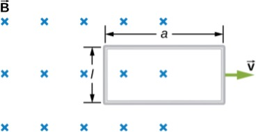

# {{ params.vars.title }}
The rectangular loop of $N$ turns shown below moves to the right with a constant velocity $\overrightarrow{ v}$ while leaving the poles of a large electromagnet.

## Question Text

Assuming that the magnetic field is uniform between the pole faces and negligible elsewhere, determine the induced emf in the loop.

### Answer Section

## Attribution

Problem is from the [OpenStax University Physics Volume 2](https://openstax.org/details/books/university-physics-volume-2) textbook, licensed under the [CC-BY 4.0 license](https://creativecommons.org/licenses/by/4.0/). 