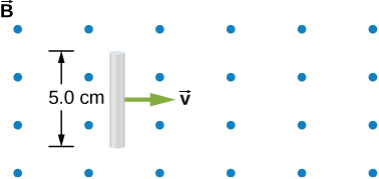

# {{ params.vars.title }}
The rod shown in the accompanying figure is moving through a uniform magnetic field of strength ${{params.B }} \textrm{ T}$ with a constant velocity of magnitude ${{params.v }} \textrm{ m/s}$.

## Part 1

What is the potential difference between the ends of the rod?

### Answer Section

Please enter a numeric value.

## Part 2

Which end of the rod is at a higher potential?

### Answer Section

- {{ params.part2.ans1.value }}
- {{ params.part2.ans2.value }}

## Attribution

Problem is from the [OpenStax University Physics Volume 2](https://openstax.org/details/books/university-physics-volume-2) textbook, licensed under the [CC-BY 4.0 license](https://creativecommons.org/licenses/by/4.0/). 