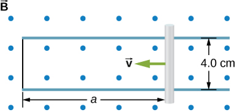

# {{ params.vars.title }}
In the accompanying figure, the rails, connecting end piece, and rod all have a resistance per unit length of ${{params.r }}$ $\rm\ \Omega$$/$$\textrm{cm}$. The rod moves to the left at a $v=$ ${{params.v }} \textrm{ m/s}$.

## Part 1

If $B=$ ${{params.B }} \textrm{ T}$ everywhere in the region, what is the magnitude of the induced current in the circuit when $a=$ ${{params.a }} \textrm{ cm}$?

### Answer Section

Please enter a numeric value.

## Part 2

Does the induced current circulate clockwise or counterclockwise?

### Answer Section

- {{ params.part2.ans1.value }}
- {{ params.part2.ans2.value }}

### pl-submission-panel

{{ submitted_answers.part1_ans_str }}
{{ feedback.part1_ans }}

### pl-answer-panel

## Attribution

Problem is from the [OpenStax University Physics Volume 2](https://openstax.org/details/books/university-physics-volume-2) textbook, licensed under the [CC-BY 4.0 license](https://creativecommons.org/licenses/by/4.0/). 