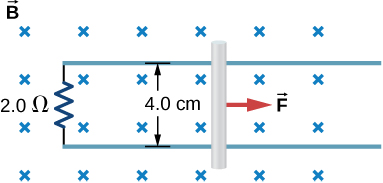

# {{ params.vars.title }}
Shown below is a conducting rod that slides along metal rails. The apparatus is in a uniform magnetic field of strength ${{params.B }} \textrm{ T}$, which is directly into the page. The rod is pulled to the right at a constant speed of ${{params.v }} \textrm{ m/s}$ by a force $\overrightarrow{F}$. The only significant resistance in the circuit comes from the $2.0 \rm\ \Omega$ resistor shown.

## Part 1

What is the emf induced in the circuit?

### Answer Section

Please enter a numeric value.

## Part 2

What is the induced current?

### Answer Section

Please enter a numeric value.

## Part 3

Does the induced current circulate clockwise or counterclockwise?

### Answer Section

- {{ params.part3.ans1.value }}
- {{ params.part3.ans2.value }}

## Part 4

What is the magnitude of $\overrightarrow{F}$?

### Answer Section

Please enter a numeric value.

## Part 5

What is the power output of $\overrightarrow{F}$?

### Answer Section

Please enter a numeric value.

## Part 6

What is the power dissipated in the resistor?

### Answer Section

Please enter a numeric value.

### pl-submission-panel

{{ submitted_answers.part1_ans_str }}
{{ feedback.part1_ans }}

### pl-answer-panel

## Attribution

Problem is from the [OpenStax University Physics Volume 2](https://openstax.org/details/books/university-physics-volume-2) textbook, licensed under the [CC-BY 4.0 license](https://creativecommons.org/licenses/by/4.0/). 