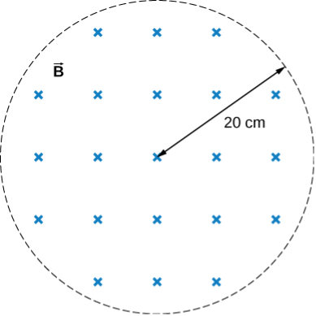

# {{ params.vars.title }}
The magnetic field at all points within the cylindrical region whose cross-section is indicated in the accompanying figure starts at magnetic field of {{params.B }} $\textrm{ T}$ and decreases uniformly to zero in {{params.t }}  $\textrm{ s}$.

## Part 1

What is the magnitude of the electric field when $r$, the distance from the geometric center of the region, is ${{params.r }} \textrm{ cm}$?

### Answer Section

Please enter a numeric value.

## Part 2

What is the direction of this electric field?

### Answer Section

- {{ params.part2.ans1.value }}
- {{ params.part2.ans2.value }}

### pl-submission-panel

{{ submitted_answers.part1_ans_str }}
{{ feedback.part1_ans }}

### pl-answer-panel

## Attribution

Problem is from the [OpenStax University Physics Volume 2](https://openstax.org/details/books/university-physics-volume-2) textbook, licensed under the [CC-BY 4.0 license](https://creativecommons.org/licenses/by/4.0/). 