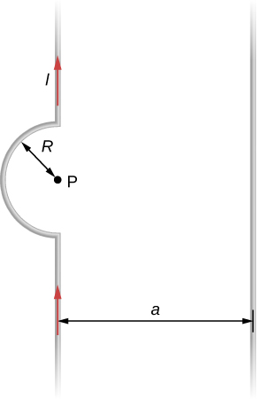

# {{ params_vars_title }}
Two long wires, one of which has a semicircular bend of radius $R$, are positioned as shown in the figure.

## Part 1

If both wires carry a current $I$, how far apart must their parallel sections be so that the net magnetic field at P is zero?

In your symbolic expression, use pi to represent π.

### Answer Section

## Part 2

What is the direction of the current in the straight wire on the right-hand side?

### Answer Section

- {{ params_part2_ans1_value }}
- {{ params_part2_ans2_value }}

## Attribution

Problem is from the [OpenStax University Physics Volume 2](https://openstax.org/details/books/university-physics-volume-2) textbook, licensed under the [CC-BY 4.0 license](https://creativecommons.org/licenses/by/4.0/). 