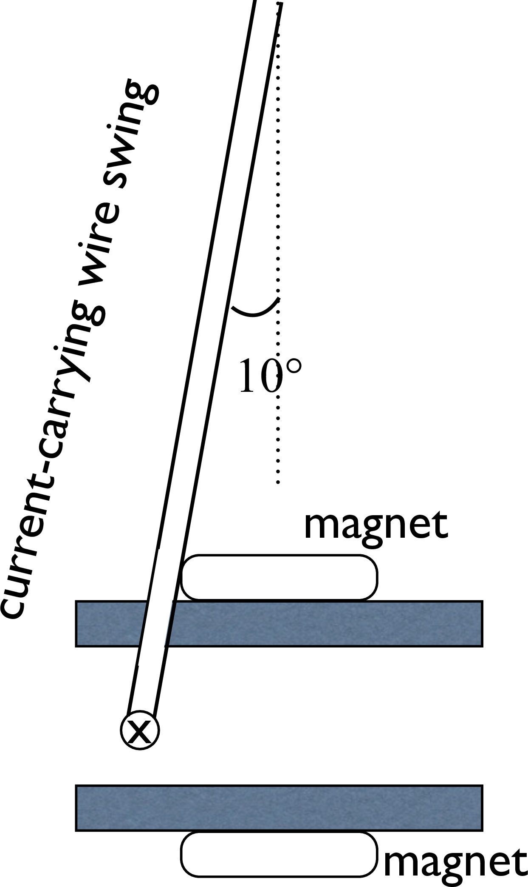

# {{ params.vars.title }}
A current-carrying wire was deflected by a magnetic field as shown in the figure below. The direction of the current at the bottom of the wire is into the screen (as shown by the $\textbf{X}$).

## Part 1

What is the direction of the magnetic field between the plates of the magnet?
Explain how you arrived at your answer specifying what direction fingers pointed and what they represented as you applied the right hand rule.

### Answer Section

## Part 2

If the current-carrying wire makes an angle $10^{\circ}$ relative to the vertical when the current through the wire is ${{ params.a}} \textrm{A}$ , solve for the strength of the magnetic field between the plates.
The length of the bottom of of the current-carrying wire is ${{ params.length}}\textrm{ cm}$, and the swing has a mass of ${{ params.mass}}\textrm{ g}$.
Use a free body diagram to write two equations and solve them for the magnetic field strength.

### Answer Section

Please enter in a numeric value in {{ params.vars.units }}.

## Attribution

Problem is licensed under the [CC-BY-NC-SA 4.0 license](https://creativecommons.org/licenses/by-nc-sa/4.0/).  