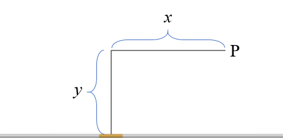

# {{ params.vars.title }}
A ${{ params.I }}\rm\ A$ current flows through the wire shown in the figure.
Take $x = {{ params.x }}\rm\ cm$ and $y = {{ params.y }}\rm\ cm$.

## Question Text

What is the magnitude of the magnetic field due to a ${{ params.dl }}\rm\ mm$ segment of wire as measured at point P?

### Answer Section

## Attribution

Problem is from the [OpenStax University Physics Volume 2](https://openstax.org/details/books/university-physics-volume-2) textbook, licensed under the [CC-BY 4.0 license](https://creativecommons.org/licenses/by/4.0/). 