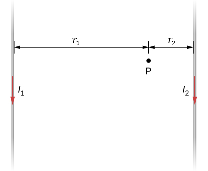

# {{ params_vars_title }}
The two long, parallel wires shown in the figure carry currents in the same direction (towards the bottom of the screen).
Note that the figure is not drawn to scale.

## Part 1

If $I_1 = {{params_I1}}\rm\ A$, $r_1 = {{params_r1}}\rm\ cm$, $I_2 = {{params_I2}}\rm\ A$, and $r_2 = {{params_r2}}\rm\ cm$, what is the magnitude of the magnetic field at point P?

### Answer Section

## Part 2

What is the direction of the magnetic field at point P?

### Answer Section

- {{ params_part2_ans1_value }}
- {{ params_part2_ans2_value }}
- {{ params_part2_ans3_value }}
- {{ params_part2_ans4_value }}
- {{ params_part2_ans5_value }}
- {{ params_part2_ans6_value }}
- {{ params_part2_ans7_value }}

### pl-submission-panel

{{ feedback.part1_ans }}

## Attribution

Problem is from the [OpenStax University Physics Volume 2](https://openstax.org/details/books/university-physics-volume-2) textbook, licensed under the [CC-BY 4.0 license](https://creativecommons.org/licenses/by/4.0/). 