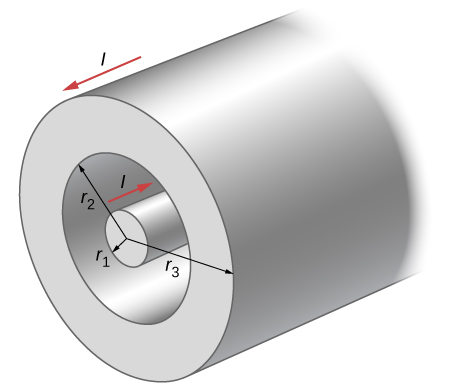

# {{ params.vars.title }}
A portion of a long, cylindrical coaxial cable is shown in the figure.
A current $I$ flows down the centre conductor, and this current is returned in the outer conductor.

## Part 1

Determine the magnitude of the magnetic field in the region $r\\< r_1$.

In your symbolic expression, you may copy and paste the Greek symbol `μ0`. Use `pi` to represent π.

### Answer Section

## Part 2

What is the direction of the magnetic field calculated in Part 1?

### Answer Section

- {{ params.part2.ans1.value }}
- {{ params.part2.ans2.value }}
- {{ params.part2.ans3.value }}

## Part 3

Determine the magnitude of the magnetic field in the region $r_1\\< r\\< r_2$.

In your symbolic expression, you may copy and paste the Greek symbol `μ0`. Use pi to represent `π`.

### Answer Section

## Part 4

What is the direction of the magnetic field calculated in Part 3?

### Answer Section

- {{ params.part4.ans1.value }}
- {{ params.part4.ans2.value }}
- {{ params.part4.ans3.value }}

## Part 5

Determine the magnitude of the magnetic field in the region $r_2\\< r\\< r_3$.

In your symbolic expression, you may copy and paste the Greek symbol `μ0`. Use `pi` to represent `π`.

### Answer Section

## Part 6

What is the direction of the magnetic field calculated in Part 5?

### Answer Section

- {{ params.part6.ans1.value }}
- {{ params.part6.ans2.value }}
- {{ params.part6.ans3.value }}

## Part 7

Determine the magnitude of the magnetic field in the region $r > r_3$.

In your symbolic expression, you may copy and paste the Greek symbol `μ0`. Use `pi` to represent π.

### Answer Section

## Part 8

What is the direction of the magnetic field calculated in Part 7?

### Answer Section

- {{ params.part8.ans1.value }}
- {{ params.part8.ans2.value }}
- {{ params.part8.ans3.value }}

## Attribution

Problem is from the [OpenStax University Physics Volume 2](https://openstax.org/details/books/university-physics-volume-2) textbook, licensed under the [CC-BY 4.0 license](https://creativecommons.org/licenses/by/4.0/). 