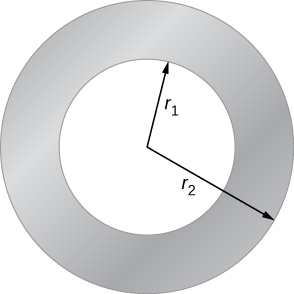

# {{ params.vars.title }}
The figure shows a cross-section of a long, hollow, cylindrical conductor of inner radius $r_1 = {{ params.r1 }}\rm\ cm$ and outer radius $r_2 = {{ params.r2 }}\rm\ cm$.
A ${{ params.I }}\rm\ A$ current distrubted uniformly over the cross-section flows into the screen.

## Part 1

Calculate the magnitude of the magnetic field at a radius $r = {{ params.ra }}\rm\ cm$ measured from the axis of the hollow cylinder.

### Answer Section

## Part 2

Calculate the magnitude of the magnetic field at a radius $r = {{ params.rb }}\rm\ cm$ measured from the axis of the hollow cylinder.

### Answer Section

## Part 3

Calculate the magnitude of the magnetic field at a radius $r = {{ params.rc }}\rm\ cm$ measured from the axis of the hollow cylinder.

### Answer Section

## Attribution

Problem is from the [OpenStax University Physics Volume 2](https://openstax.org/details/books/university-physics-volume-2) textbook, licensed under the [CC-BY 4.0 license](https://creativecommons.org/licenses/by/4.0/). 