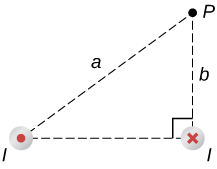

# {{ params.vars.title }}
A circuit with current $I$ has two long parallel wire sections that carry current in opposite directions.
Find expressions for the $x$- and $y$-components of the magnetic field at point P which is a distance $a$ from one wire and $b$ from the other wire, as shown in the figure.

## Part 1

The $x$-component:

You may copy and paste the Greek character μ0 into you symbolic expression.
Use pi to represent π.

### Answer Section
## Part 2

The $y$-component:

You may copy and paste the Greek character μ0 into you symbolic expression.
Use pi to represent π.

### Answer Section

- {{ params.part2.ans1.value }}
- {{ params.part2.ans2.value }}

## Attribution

Problem is from the [OpenStax University Physics Volume 2](https://openstax.org/details/books/university-physics-volume-2) textbook, licensed under the [CC-BY 4.0 license](https://creativecommons.org/licenses/by/4.0/). 