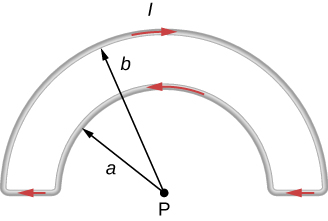

# {{ params.vars.title }}
What is the magnetic field at point P due to the current $I$ in the loop of wire shown?

## Part 1

You may copy the Greek symbol μ0 into your symbolic expression.

Magnitude:

### Answer Section

## Part 2

Direction:

### Answer Section

- {{ params.part2.ans1.value }}
- {{ params.part2.ans2.value }}
- {{ params.part2.ans3.value }}

## Attribution

Problem is from the [OpenStax University Physics Volume 2](https://openstax.org/details/books/university-physics-volume-2) textbook, licensed under the [CC-BY 4.0 license](https://creativecommons.org/licenses/by/4.0/). 