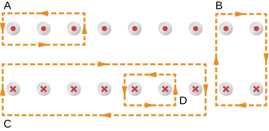

# {{ params_vars_title }}
The coil whose lengthwise cross section is shown in the figure carries a current $I$ and has $N$ evenly-spaced turns distributed along the length $\ell$.
Evaluate the magnetic flux $\oint\vec{\mathbf{B}}\cdot d\vec{\mathbf{\ell}}$ for each of the paths indicated.

## Part 1

Path A:

### Answer Section

- {{ params_part1_ans1_value }}
- {{ params_part1_ans2_value }}
- {{ params_part1_ans3_value }}
- {{ params_part1_ans4_value }}
- {{ params_part1_ans5_value }}

## Part 2

Path B:

### Answer Section

- {{ params_part2_ans1_value }}
- {{ params_part2_ans2_value }}
- {{ params_part2_ans3_value }}
- {{ params_part2_ans4_value }}
- {{ params_part2_ans5_value }}

## Part 3

Path C:

### Answer Section

- {{ params_part3_ans1_value }}
- {{ params_part3_ans2_value }}
- {{ params_part3_ans3_value }}
- {{ params_part3_ans4_value }}
- {{ params_part3_ans5_value }}

## Part 4

Path D:

### Answer Section

- {{ params_part4_ans1_value }}
- {{ params_part4_ans2_value }}
- {{ params_part4_ans3_value }}
- {{ params_part4_ans4_value }}
- {{ params_part4_ans5_value }}

## Attribution

Problem is from the [OpenStax University Physics Volume 2](https://openstax.org/details/books/university-physics-volume-2) textbook, licensed under the [CC-BY 4.0 license](https://creativecommons.org/licenses/by/4.0/). 