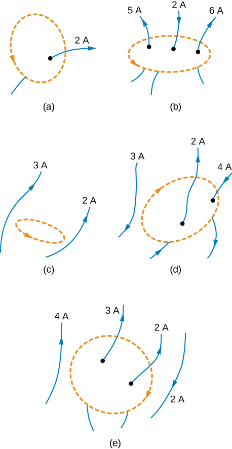

# {{ params.vars.title }}
Evaluate the magnetic flux $\oint\vec{\mathbf{B}}\cdot d\vec{\mathbf{\ell}}$ for each of the cases shown in the figure.

## Part 1

Part (a):

### Answer Section

- {{ params.part1.ans1.value }}
- {{ params.part1.ans2.value }}
- {{ params.part1.ans3.value }}
- {{ params.part1.ans4.value }}
- {{ params.part1.ans5.value }}

## Part 2

Part (b):

### Answer Section

- {{ params.part2.ans1.value }}
- {{ params.part2.ans2.value }}
- {{ params.part2.ans3.value }}
- {{ params.part2.ans4.value }}
- {{ params.part2.ans5.value }}

## Part 3

Part (c):

### Answer Section

- {{ params.part3.ans1.value }}
- {{ params.part3.ans2.value }}
- {{ params.part3.ans3.value }}
- {{ params.part3.ans4.value }}
- {{ params.part3.ans5.value }}

## Part 4

Part (d):

### Answer Section

- {{ params.part4.ans1.value }}
- {{ params.part4.ans2.value }}
- {{ params.part4.ans3.value }}
- {{ params.part4.ans4.value }}
- {{ params.part4.ans5.value }}

## Part 5

Part (e):

### Answer Section

- {{ params.part5.ans1.value }}
- {{ params.part5.ans2.value }}
- {{ params.part5.ans3.value }}
- {{ params.part5.ans4.value }}
- {{ params.part5.ans5.value }}

## Attribution

Problem is from the [OpenStax University Physics Volume 2](https://openstax.org/details/books/university-physics-volume-2) textbook, licensed under the [CC-BY 4.0 license](https://creativecommons.org/licenses/by/4.0/). 