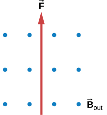
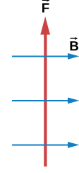
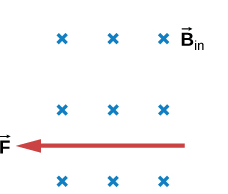

# {{ params_vars_title }}
What is the direction of a current that experiences the magnetic force shown in each of the three cases, assuming the current runs perpendicular to to $B$?

## Part 1

### Answer Section

- {{ params_part1_ans1_value}}
- {{ params_part1_ans2_value}}
- {{ params_part1_ans3_value}}
- {{ params_part1_ans4_value}}
- {{ params_part1_ans5_value}}
- {{ params_part1_ans6_value}}

## Part 2

### Answer Section

- {{ params_part2_ans1_value}}
- {{ params_part2_ans2_value}}
- {{ params_part2_ans3_value}}
- {{ params_part2_ans4_value}}
- {{ params_part2_ans5_value}}
- {{ params_part2_ans6_value}}

## Part 3

### Answer Section

- {{ params_part3_ans1_value}}
- {{ params_part3_ans2_value}}
- {{ params_part3_ans3_value}}
- {{ params_part3_ans4_value}}
- {{ params_part3_ans5_value}}
- {{ params_part3_ans6_value}}

## Attribution

Problem is licensed under the [CC-BY-NC-SA 4.0 license](https://creativecommons.org/licenses/by-nc-sa/4.0/).  