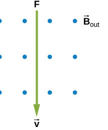
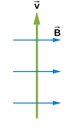
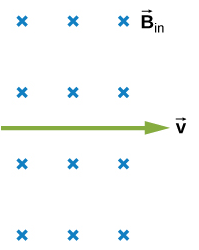
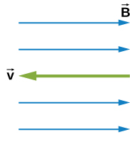
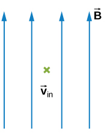
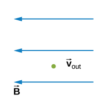

# {{ params.vars.title }}
What is the direction of the magnetic force on a positive charge that moves as shown in each of the six cases?

## Part 1

### Answer Section

- {{ params.part1.ans1.value}}
- {{ params.part1.ans2.value}}
- {{ params.part1.ans3.value}}
- {{ params.part1.ans4.value}}
- {{ params.part1.ans5.value}}
- {{ params.part1.ans6.value}}
- {{ params.part1.ans7.value}}

## Part 2

### Answer Section

- {{ params.part2.ans1.value}}
- {{ params.part2.ans2.value}}
- {{ params.part2.ans3.value}}
- {{ params.part2.ans4.value}}
- {{ params.part2.ans5.value}}
- {{ params.part2.ans6.value}}
- {{ params.part2.ans7.value}}

## Part 3

### Answer Section

- {{ params.part3.ans1.value}}
- {{ params.part3.ans2.value}}
- {{ params.part3.ans3.value}}
- {{ params.part3.ans4.value}}
- {{ params.part3.ans5.value}}
- {{ params.part3.ans6.value}}
- {{ params.part3.ans7.value}}

## Part 4

### Answer Section

- {{ params.part4.ans1.value}}
- {{ params.part4.ans2.value}}
- {{ params.part4.ans3.value}}
- {{ params.part4.ans4.value}}
- {{ params.part4.ans5.value}}
- {{ params.part4.ans6.value}}
- {{ params.part4.ans7.value}}

## Part 5

### Answer Section

- {{ params.part5.ans1.value}}
- {{ params.part5.ans2.value}}
- {{ params.part5.ans3.value}}
- {{ params.part5.ans4.value}}
- {{ params.part5.ans5.value}}
- {{ params.part5.ans6.value}}
- {{ params.part5.ans7.value}}

## Part 6

### Answer Section

- {{ params.part6.ans1.value}}
- {{ params.part6.ans2.value}}
- {{ params.part6.ans3.value}}
- {{ params.part6.ans4.value}}
- {{ params.part6.ans5.value}}
- {{ params.part6.ans6.value}}
- {{ params.part6.ans7.value}}

## Attribution

Problem is licensed under the [CC-BY-NC-SA 4.0 license](https://creativecommons.org/licenses/by-nc-sa/4.0/).  