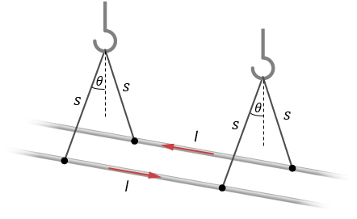

# {{ params.vars.title }}
Two long, parallel wires are hung by cords of length $s = $ {{ params.s }} $\rm\ cm$, as shown in the figure.
Each wire has a mass per unit length of {{ params.mu }} $\rm\ g/m$, and they carry the same current in opposite directions.

## Question Text

What is the current if the cords hang at $\theta =$ {{ params.theta }}$^\circ$ with respect to the vertical?

### Answer Section

## Attribution

Problem is from the [OpenStax University Physics Volume 2](https://openstax.org/details/books/university-physics-volume-2) textbook, licensed under the [CC-BY 4.0 license](https://creativecommons.org/licenses/by/4.0/). 